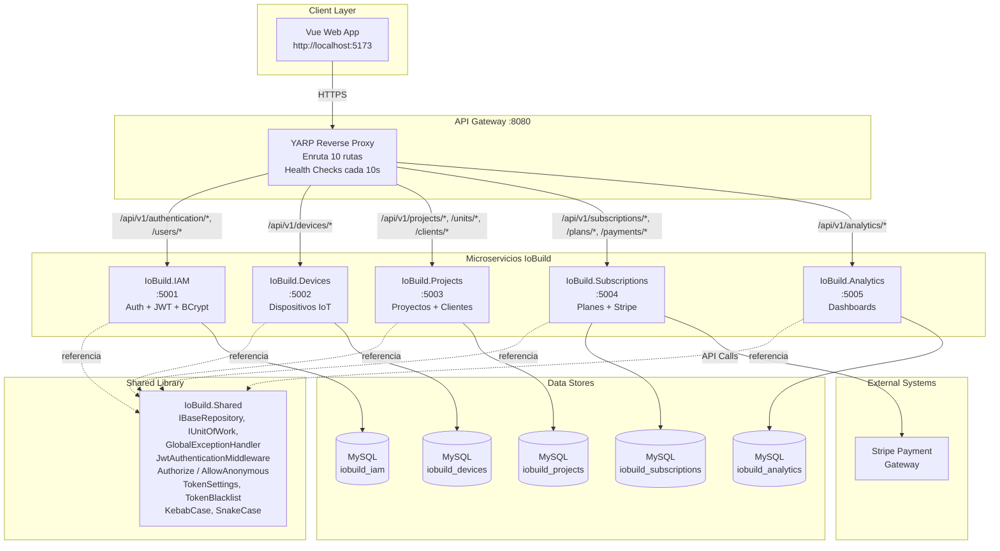

# Capítulo V: Análisis Arquitectónico y de Calidad

## 5.1 Backend Application Architecture & Quality Assurance

---

### 5.1.1 Backend Application Core Testing Suite

#### Estrategia de Pruebas

La estrategia de pruebas está alineada con la pirámide de testing y los bounded contexts identificados en las iteraciones ADD.

#### Pirámide de Pruebas

| Nivel | Framework | Enfoque | Bounded Context | Estado |
|-------|-----------|---------|-----------------|--------|
| **BDD / Aceptación** | SpecFlow + xUnit + Moq | Comportamiento extremo a extremo según User Stories | IAM, Devices, Projects, Subscriptions | ✅ 16/16 tests pasando (step definitions implementados) |
| **Unitarias (Capa Domain)** | xUnit + Moq + FluentAssertions | Lógica de dominio y comandos/queries | Todos | ⏳ Scaffolding listo |
| **Integración Runtime (API real)** | Bash + curl / PowerShell | Tests HTTP contra APIs reales | Gateway, IAM, Devices, Projects, Subscriptions | ✅ 10/10 tests pasando |
| **Integración (API con factory)** | xUnit + WebApplicationFactory | Pipeline completo con middleware | IAM | ⏳ Pendiente |
| **Integración (BD real)** | Testcontainers.MySql | Validación de repositorios EF Core | Shared | ⏳ Pendiente |

#### Proyectos de Test Implementados

| Proyecto | Ubicación | Paquetes |
|----------|-----------|----------|
| **IoBuild.IAM.Tests** | `microservices/tests/IoBuild.IAM.Tests/` | xUnit, Moq, FluentAssertions, SpecFlow.xUnit |
| **IoBuild.Devices.Tests** | `microservices/tests/IoBuild.Devices.Tests/` | xUnit, Moq, FluentAssertions, SpecFlow.xUnit |
| **IoBuild.Projects.Tests** | `microservices/tests/IoBuild.Projects.Tests/` | xUnit, Moq, FluentAssertions, SpecFlow.xUnit |
| **IoBuild.Subscriptions.Tests** | `microservices/tests/IoBuild.Subscriptions.Tests/` | xUnit, Moq, FluentAssertions, SpecFlow.xUnit |

#### Escenarios Gherkin Implementados

Se definieron **4 Features** con **16 escenarios BDD** (incluyendo backgrounds), todos con Step Definitions implementados y pasando:

---

**Feature: Autenticación de Usuarios (US44 / QA-1)**
```gherkin
Feature: Autenticacion de Usuarios
  ...
  @US44 @QA-1 @Critical
  Scenario: Inicio de sesion exitoso con credenciales validas
    When POST "/api/v1/authentication/sign-in" { email, password }
    Then 200 OK + JWT con claims {sid, email, role} + exp: 7 dias

  @US44 @QA-1 @Security
  Scenario: Inicio de sesion fallido por contrasena incorrecta
    When POST "/api/v1/authentication/sign-in" { wrong password }
    Then 401 Unauthorized

  @QA-1 @Security
  Scenario: Acceso a endpoint protegido sin token
    When GET "/api/v1/users" (sin Authorization header)
    Then 401 "Authorization token is required."
```
**Archivo:** `microservices/tests/IoBuild.IAM.Tests/Features/Authentication.feature`

---

**Feature: Gestión de Dispositivos IoT (US33 / QA-2)**
```gherkin
Feature: Gestion de Dispositivos IoT
  @US33 @QA-2
  Scenario: Listar todos los dispositivos
    When GET "/api/v1/devices"
    Then 200 OK + lista con {id, name, type, location, status, projectId}

  @US33 @QA-2
  Scenario: Obtener detalle de un dispositivo por ID
    When GET "/api/v1/devices/1"
    Then 200 OK + nombre "Termostato Lobby"

  @QA-2 @Security
  Scenario: Usuario no autenticado no puede listar dispositivos
    When GET "/api/v1/devices" (sin token)
    Then 401 Unauthorized
```
**Archivo:** `microservices/tests/IoBuild.Devices.Tests/Features/DeviceManagement.feature`

---

**Feature: Gestión de Proyectos (CRN-1)**
```gherkin
Feature: Gestion de Proyectos y Clientes
  @CRN-1
  Scenario: Listar todos los proyectos
    When GET "/api/v1/projects"
    Then 200 OK + cada proyecto: {id, name, description, location, totalUnits, status}

  @CRN-1
  Scenario: Crear un nuevo proyecto
    When POST "/api/v1/projects" { name, description, location, totalUnits }
    Then 201 Created + ID del proyecto

  @CRN-1
  Scenario: Asignar un cliente a un proyecto
    When POST "/api/v1/clients" { fullName, projectId, email }
    Then 201 Created + cliente asociado al proyecto
```
**Archivo:** `microservices/tests/IoBuild.Projects.Tests/Features/ProjectsManagement.feature`

---

**Feature: Renovación de Plan de Suscripción (US31 / QA-3)**
```gherkin
Feature: Renovacion de Plan de Suscripcion
  @US31 @QA-3 @Payment
  Scenario: Crear sesion de pago para renovar plan
    When POST "/api/v1/subscriptions/payments/create-session" { planId, builderId }
    Then 200 OK + URL de checkout Stripe

  @QA-3 @Payment @Critical
  Scenario: Confirmar pago exitoso y activar suscripcion
    When Webhook Stripe notifica pago exitoso
    Then Subscription status = "active" + fecha_fin = +1 mes

  @QA-3 @Payment
  Scenario: Webhook con pago fallido no activa la suscripcion
    When Webhook notifica pago fallido
    Then Subscription no se modifica + estado = "pending"
```
**Archivo:** `microservices/tests/IoBuild.Subscriptions.Tests/Features/SubscriptionRenewal.feature`

#### Verificación Real Realizada

Se implementaron **Integration Tests runtime** automatizados (`run_integration_tests.sh` / `.ps1`) que levantan los servicios, ejecutan 10 tests HTTP reales y los detienen:

| # | Prueba | Resultado | Comportamiento Validado |
|---|--------|-----------|----------------------|
| 1 | Health Check Global | ✅ 200 | Gateway responde |
| 2 | Sign Up | ✅ 200/409 | Creación o usuario ya existe |
| 3 | Sign In | ✅ 200 + JWT | Login exitoso con token |
| 4 | Login con contraseña incorrecta | ✅ **401 Unauthorized** | Antes daba 500, ahora distingue excepciones |
| 5 | Crear proyecto (autenticado) | ✅ **201 Created** | Proyecto creado con imageUrl |
| 6 | Listar proyectos (autenticado) | ✅ 200 + lista | CRUD projects funcional |
| 7 | Listar proyectos SIN autenticación | ✅ **401 Unauthorized** | Auth extendido a Projects |
| 8 | Listar dispositivos SIN autenticación | ✅ **401 Unauthorized** | Auth extendido a Devices |
| 9 | Listar planes (público) | ✅ 200 + catálogo | Planes sin auth |
| 10 | Health Checks individuales (5 servicios) | ✅ 200 (5/5) | Todos los servicios saludables |

> **Resultado global:** 10/10 tests pasando ✅

#### Herramientas de Testing

| Herramienta | Propósito | Paquete NuGet |
|------------|-----------|---------------|
| **xUnit** | Framework de pruebas unitarias y de integración | `xunit` / `xunit.runner.visualstudio` |
| **Moq** | Mocking de dependencias (servicios, repositorios) | `Moq` |
| **FluentAssertions** | Aserciones legibles y declarativas | `FluentAssertions` |
| **SpecFlow** | Pruebas BDD con Gherkin | `SpecFlow` / `SpecFlow.xUnit` |
| **Testcontainers.MySql** | Contenedores MySQL efímeros para integración real | `Testcontainers.MySql` |
| **Coverlet** | Cobertura de código | `coverlet.collector` |

**Objetivo de cobertura futura:** Mínimo 70% en capa Domain + Application, y 50% en capa Infrastructure.

---

### 5.1.2 Pattern Based Backend Application(s)

El proyecto IoBuild fue refactorizado de un monolito (`IoBuild-Backend/IoBuilt.API`) a **6 microservicios independientes** en `microservices/src/`. A continuación se documentan los patrones implementados con evidencia directa del código fuente actual.

---

#### 5.1.2.1 API Gateway (YARP Reverse Proxy)

**Tipo:** Patrón Arquitectónico — API Gateway

**Ubicación:** `microservices/src/IoBuild.Gateway/Program.cs` + `appsettings.json`

**Descripción:** El API Gateway es el **único punto de entrada** al sistema. Usa YARP (Yet Another Reverse Proxy) para enrutar cada petición al microservicio correspondiente según el path. También centraliza CORS, health checks y manejo global de errores.

```csharp
// Program.cs — IoBuild.Gateway
builder.Services.AddReverseProxy()
    .LoadFromConfig(builder.Configuration.GetSection("ReverseProxy"));

builder.Services.AddHealthChecks()
    .AddUrlGroup(new Uri("http://localhost:5001/health"), "IoBuild.IAM")
    .AddUrlGroup(new Uri("http://localhost:5002/health"), "IoBuild.Devices")
    .AddUrlGroup(new Uri("http://localhost:5003/health"), "IoBuild.Projects")
    .AddUrlGroup(new Uri("http://localhost:5004/health"), "IoBuild.Subscriptions")
    .AddUrlGroup(new Uri("http://localhost:5005/health"), "IoBuild.Analytics");

app.UseMiddleware<GlobalExceptionHandlerMiddleware>();
app.UseCors("GatewayCorsPolicy");
app.MapHealthChecks("/health");
app.MapReverseProxy();  // ← YARP enruta según appsettings.json
```

**Configuración de Rutas** (`appsettings.json`):
```json
"Routes": {
  "iam-auth":    { "ClusterId": "iam-cluster",  "Match": { "Path": "/api/v1/authentication/{**catch-all}" } },
  "devices-all": { "ClusterId": "devices-cluster","Match": { "Path": "/api/v1/devices/{**catch-all}" } },
  "projects-all":{ "ClusterId": "projects-cluster","Match": { "Path": "/api/v1/projects/{**catch-all}" } },
  ...
}
"Clusters": {
  "iam-cluster":      { "Destinations": { "dest": { "Address": "http://localhost:5001/" } } },
  "devices-cluster":  { "Destinations": { "dest": { "Address": "http://localhost:5002/" } } },
  ...
}
```

**Driver ADD asociado:** CRN-1 (Greenfield), CON-1 (Microservicios). Centraliza el enrutamiento y permite escalar cada servicio independientemente.

---

#### 5.1.2.2 Dependency Injection (Inversión de Control / DI)

**Tipo:** GoF — Singleton / Scoped

**Ubicación:** Cada `Program.cs` en `microservices/src/IoBuild.*/`

**Descripción:** Cada microservicio registra explícitamente sus dependencias en el contenedor DI con su tiempo de vida correspondiente.

```csharp
// microservices/src/IoBuild.IAM/Program.cs
builder.Services.AddScoped<IUnitOfWork>(sp => sp.GetRequiredService<ApplicationDbContext>());
builder.Services.AddScoped<IUserRepository, UserRepository>();
builder.Services.AddScoped<IUserCommandService, UserCommandService>();
builder.Services.AddScoped<IUserQueryService, UserQueryService>();
builder.Services.AddScoped<ITokenService, TokenService>();
builder.Services.AddScoped<IHashingService, HashingService>();
builder.Services.AddMemoryCache();
builder.Services.AddScoped<ITokenBlacklistService, TokenBlacklistService>();
```

**Driver ADD asociado:** CON-1 — la DI permite intercambiar implementaciones sin acoplar código, esencial para microservicios.

---

#### 5.1.2.3 Facade / Service Layer

**Tipo:** GoF — Facade / Service Layer

**Ubicación:** 
- `microservices/src/IoBuild.IAM/Domain/Services/IUserCommandService.cs`
- `microservices/src/IoBuild.IAM/Application/Internal/CommandServices/UserCommandService.cs`
- Análogo en Devices, Projects, Subscriptions, Analytics

**Descripción:** Las interfaces de servicio actúan como **Fachada** entre los controladores REST y la lógica de dominio. Cada método recibe un Command o Query y orquesta repositorio + servicios de infraestructura.

```csharp
// UserCommandService.cs — Fachada que orquesta
public class UserCommandService(
    IUserRepository userRepository,
    ITokenService tokenService,
    IHashingService hashingService,
    IUnitOfWork unitOfWork) : IUserCommandService
{
    public async Task<(User user, string token)> Handle(SignInCommand command)
    {
        var user = await userRepository.FindByEmailAsync(command.Email);
        if (user == null || !hashingService.VerifyPassword(command.Password, user.PasswordHash))
            throw new UnauthorizedAccessException("Invalid email or password.");
        var token = tokenService.GenerateToken(user);
        return (user, token);
    }
}
```

```csharp
// AuthenticationController.cs — Controlador delgado
[HttpPost("sign-in")]
[AllowAnonymous]
public async Task<IActionResult> SignIn([FromBody] SignInResource resource)
{
    var command = SignInCommandFromResourceAssembler.ToCommand(resource);
    var (user, token) = await userCommandService.Handle(command);
    var resource = AuthenticatedUserResourceFromEntityAssembler.ToResource(user, token);
    return Ok(resource);
}
```

**Driver ADD asociado:** QA-1 — la fachada centraliza la lógica sensible de autenticación.

---

#### 5.1.2.4 Chain of Responsibility / Middleware Pipeline

**Tipo:** GoF — Chain of Responsibility

**Ubicación:**
- `microservices/src/IoBuild.IAM/Infrastructure/Pipeline/Middleware/Components/RequestAuthorizationMiddleware.cs`
- `microservices/src/IoBuild.Shared/Infrastructure/Middleware/JwtAuthenticationMiddleware.cs`

**Descripción:** El pipeline de ASP.NET Core forma una **Cadena de Responsabilidad**. Cada middleware decide si procesa o pasa al siguiente. Originalmente solo IAM tenía middleware de autorización. Para cubrir todos los microservicios, se creó `JwtAuthenticationMiddleware` en `IoBuild.Shared` que:

1. Si el path es `/health` o `/swagger` → pasa (sin auth)
2. Si tiene `[AllowAnonymous]` → pasa
3. Extrae JWT del header `Authorization`
4. Valida la firma JWT usando `TokenSettings.Secret` (HMAC-SHA256)
5. Extrae claims `sid`, `email`, `role` y los almacena en `HttpContext.Items`
6. Pasa al siguiente middleware

Este middleware **compartido** se registra en `Projects` y `Devices` mediante `app.UseJwtAuthentication()`, extendiendo la autenticación a todos los servicios del sistema.

**Coordinación con atributo `[Authorize]`:**

El atributo `[Authorize]` implementa `IAuthorizationFilter`, que es parte del **pipeline de filtros de ASP.NET Core** (ejecutado después del middleware pero antes del action del controller). Su única responsabilidad es verificar que `HttpContext.Items["User"]` fue poblado por el middleware anterior:

```csharp
[AttributeUsage(AttributeTargets.Class | AttributeTargets.Method)]
public class AuthorizeAttribute : Attribute, IAuthorizationFilter
{
    public void OnAuthorization(AuthorizationFilterContext context)
    {
        var user = context.HttpContext.Items["User"];
        if (user is null)
        {
            context.Result = new UnauthorizedObjectResult(new { error = "Unauthorized." });
        }
    }
}
```

**División de responsabilidades en el pipeline de auth:**
```
Request
 │
 ├─ JwtAuthenticationMiddleware (Chain of Responsibility)
 │   → Extrae token → Valida firma → Carga User en HttpContext.Items
 │
 ├─ [Authorize] Attribute (IAuthorizationFilter)
 │   → Verifica que HttpContext.Items["User"] existe → Si no, 401
 │
 └─ Controller Action (recibe request autenticado)
```

El atributo (y su contraparte `[AllowAnonymous]`) fue movido a `IoBuild.Shared/Infrastructure/ASP/Configuration/` y aplicado a los controladores de **Projects**, **Devices**, **Units** y **Clients**.

**Driver ADD asociado:** QA-1 — el 100% de las solicitudes pasan por validación JWT antes de llegar al controlador en todos los microservicios.

---

#### 5.1.2.5 Strategy Pattern (JWT + BCrypt)

**Tipo:** GoF — Strategy

**Ubicación:**
- `microservices/src/IoBuild.IAM/Application/Internal/OutboundServices/ITokenService.cs`
- `microservices/src/IoBuild.IAM/Infrastructure/Tokens/JWT/Services/TokenService.cs`
- `microservices/src/IoBuild.IAM/Application/Internal/OutboundServices/IHashingService.cs`
- `microservices/src/IoBuild.IAM/Infrastructure/Hashing/BCrypt/Services/HashingService.cs`

**Descripción:** Las interfaces definen contratos que pueden ser implementados por diferentes estrategias. Actualmente: JWT HMAC-SHA256 para tokens, BCrypt para hashing.

```csharp
// ITokenService.cs — Contrato de estrategia
public interface ITokenService
{
    string GenerateToken(User user);
    Task<int?> ValidateToken(string token);
}

// TokenService.cs — Estrategia concreta: JWT
public class TokenService(IOptions<TokenSettings> tokenSettings) : ITokenService
{
    public string GenerateToken(User user)
    {
        var key = new SymmetricSecurityKey(Encoding.UTF8.GetBytes(_tokenSettings.Secret));
        var credentials = new SigningCredentials(key, SecurityAlgorithms.HmacSha256);

        var claims = new[]
        {
            new Claim(ClaimTypes.Sid, user.Id.ToString()),
            new Claim(ClaimTypes.Email, user.Email),
            new Claim(ClaimTypes.Role, user.Role)
        };

        var token = new JwtSecurityToken(
            claims: claims,
            expires: DateTime.UtcNow.AddDays(7),
            signingCredentials: credentials);

        return new JwtSecurityTokenHandler().WriteToken(token);
    }
}
```

**Driver ADD asociado:** QA-1 — permite cambiar algoritmos de seguridad sin afectar el código cliente.

---

#### 5.1.2.6 Adapter / Assembler (Mapper Manual)

**Tipo:** GoF — Adapter

**Ubicación:** Cada microservicio tiene `Interfaces/REST/Transform/` o `Interfaces/REST/Assemblers/` con clases `*Assembler.cs`.

**Descripción:** Adaptadores manuales (sin AutoMapper) que convierten Resources (DTOs) ↔ Commands ↔ Entities.

```csharp
// SignInCommandFromResourceAssembler.cs
public static class SignInCommandFromResourceAssembler
{
    public static SignInCommand ToCommand(SignInResource resource)
        => new(resource.Email, resource.Password);
}

// AuthenticatedUserResourceFromEntityAssembler.cs
public static class AuthenticatedUserResourceFromEntityAssembler
{
    public static AuthenticatedUserResource ToResource(User user, string token)
        => new(user.Id, user.Email, user.Role, token);
}
```

**Driver ADD asociado:** CRN-1 — los DTOs evolucionan sin afectar el modelo de dominio.

---

#### 5.1.2.7 Proxy / Repository Pattern

**Tipo:** GoF — Proxy

**Ubicación:** `microservices/src/IoBuild.Shared/Domain/Repositories/IBaseRepository.cs`

**Descripción:** `IBaseRepository<TEntity>` es el contrato CRUD genérico que todos los repositorios implementan. Cada Bounded Context tiene su especialización.

```csharp
// IoBuild.Shared — Interfaz genérica
public interface IBaseRepository<TEntity>
{
    Task AddAsync(TEntity entity);
    Task<TEntity?> FindByIdAsync(int id);
    void Update(TEntity entity);
    void Remove(TEntity entity);
    Task<IEnumerable<TEntity>> ListAsync();
}

// IoBuild.Shared — Contrato de transacciones
public interface IUnitOfWork
{
    Task CompleteAsync();
}
```

| Repositorio | Microservicio | Métodos adicionales |
|-------------|---------------|-------------------|
| `UserRepository` | IoBuild.IAM | `FindByEmailAsync()`, `ExistsByEmail()` |
| `ProjectRepository` | IoBuild.Projects | Busquedas por BuilderId, Status, Name |
| `DeviceRepository` | IoBuild.Devices | CRUD directo |
| `SubscriptionRepository` | IoBuild.Subscriptions | CRUD de suscripciones |
| `PlanRepository` | IoBuild.Subscriptions | FindByName |

**Driver ADD asociado:** CRN-3 — abstrae el almacenamiento permitiendo cambiar de motor de BD.

---

#### 5.1.2.8 Token Blacklist / Revocación de JWT

**Tipo:** Patrón de Seguridad — Blacklist

**Ubicación:** `microservices/src/IoBuild.Shared/Infrastructure/Tokens/ITokenBlacklistService.cs`

**Descripción:** Servicio que mantiene una **blacklist en memoria** de tokens revocados. Cuando un usuario hace logout, su token se almacena en `IMemoryCache` hasta su expiración natural. Cada request valida contra esta blacklist antes de verificar la firma JWT.

```csharp
public interface ITokenBlacklistService
{
    void RevokeToken(string token, DateTime expiration);
    bool IsTokenRevoked(string token);
}

public class TokenBlacklistService(IMemoryCache cache) : ITokenBlacklistService
{
    public void RevokeToken(string token, DateTime expiration)
    {
        var remaining = expiration - DateTime.UtcNow;
        var duration = remaining.TotalSeconds switch
        {
            < 60 => TimeSpan.FromMinutes(1),
            > 604800 => TimeSpan.FromDays(7),
            _ => remaining
        };
        _cache.Set($"blacklist:{token.GetHashCode():X}", true, duration);
    }

    public bool IsTokenRevoked(string token)
        => _cache.TryGetValue($"blacklist:{token.GetHashCode():X}", out _);
}
```

**Driver ADD asociado:** QA-1 — implementa la revocación global de JWT, elemento crítico de seguridad.

---

#### 5.1.2.9 Domain-Driven Design: Aggregates y Value Objects

**Tipo:** DDD — Aggregate Root

**Ubicación:** Cada microservicio tiene `Domain/Model/Aggregates/`.

**Descripción:** Las entidades de dominio son **Aggregate Roots** con comportamiento encapsulado.

```csharp
// microservices/src/IoBuild.Projects/Domain/Model/Aggregates/Project.cs
public class Project
{
    public int Id { get; }
    public string Name { get; private set; }
    public EProjectStatus Status { get; private set; }
    public int BuilderId { get; private set; }

    public Project(CreateProjectCommand command)
    {
        Name = command.Name;
        Status = EProjectStatus.Planned;
        BuilderId = command.BuilderId;
    }

    public Project Update(UpdateProjectCommand command)
    {
        Name = command.Name;
        Status = command.Status;
        return this;
    }
}

// Value Objects
public enum EProjectStatus { Planned, OnGoing, OnHold, Completed, Cancelled }
public enum EAccountStatement { Active, Inactive, Suspended, Pending }
```

---

#### 5.1.2.10 Anti-Corruption Layer / ACL Facade

**Tipo:** DDD — Anti-Corruption Layer

**Ubicación:**
- `microservices/src/IoBuild.Analytics/Interfaces/ACL/IDevicesContextFacade.cs`
- `microservices/src/IoBuild.Analytics/Application/ACL/DevicesContextFacade.cs`
- `microservices/src/IoBuild.Subscriptions/Domain/Repositories/Services/ISubscriptionsContextFacade.cs`

**Descripción:** Fachadas que traducen llamadas entre Bounded Contexts, aislando cambios internos.

```csharp
// IoBuild.Analytics — ACL hacia Devices
public class DevicesContextFacade(HttpClient httpClient) : IDevicesContextFacade
{
    public async Task<int> GetTotalDevicesAsync(int projectId)
    {
        var response = await httpClient.GetAsync($"/api/v1/devices?projectId={projectId}");
        var devices = await response.Content.ReadFromJsonAsync<List<DeviceResource>>();
        return devices?.Count ?? 0;
    }
}
```

**Driver ADD asociado:** CON-1 — prepara el camino para la comunicación HTTP entre microservicios independientes.

---

#### 5.1.2.11 Resumen de Patrones Identificados

| # | Patrón | Tipo | Ubicación | ADD Driver |
|---|--------|------|-----------|------------|
| 1 | **API Gateway (YARP)** | Arquitectónico | `IoBuild.Gateway/` | CRN-1, CON-1 |
| 2 | **Dependency Injection** | GoF — Creacional | `*/Program.cs` | CON-1 |
| 3 | **Facade / Service Layer** | GoF — Estructural | `*/Domain/Services/*`, `*/Application/Internal/CommandServices/*` | QA-1 |
| 4 | **Chain of Responsibility** (Middleware Pipeline) | GoF — Comportamiento | `RequestAuthorizationMiddleware.cs` (IAM), `JwtAuthenticationMiddleware.cs` (Shared), `GlobalExceptionHandlerMiddleware` (Shared) | QA-1 |
| 5 | **Strategy (JWT + BCrypt)** | GoF — Comportamiento | `IAM/Infrastructure/Tokens/JWT/`, `IAM/Infrastructure/Hashing/BCrypt/` | QA-1 |
| 6 | **Adapter / Assembler** | GoF — Estructural | `*/Interfaces/REST/Transform/*Assembler.cs` | CRN-1 |
| 7 | **Proxy / Repository** | GoF — Estructural | `IoBuild.Shared/Domain/Repositories/IBaseRepository.cs` | CRN-3 |
| 8 | **Token Blacklist** (Revocación JWT) | Seguridad | `IoBuild.Shared/Infrastructure/Tokens/ITokenBlacklistService.cs` | QA-1 |
| 9 | **Aggregate Root** | DDD — Táctico | `*/Domain/Model/Aggregates/*.cs` | CRN-1 |
| 10 | **Anti-Corruption Layer** (ACL) | DDD — Arquitectónico | `Analytics/Application/ACL/*`, `Subscriptions/Domain/Services/*Facade.cs` | CON-1 |
| 11 | **Unit of Work** | Datos | `IoBuild.Shared/Domain/Repositories/IUnitOfWork.cs` | CRN-3 |

---

### 5.1.3 Pattern Based Custom Software Library

#### IoBuild.Shared — Librería Compartida

**Ubicación:** `microservices/src/IoBuild.Shared/` — Class Library .NET 9

**Propósito:** Evitar duplicación de código entre los microservicios. Todos los proyectos la referencian vía Project Reference.

#### Componentes Implementados

| Componente | Archivo | Propósito | Usado por |
|-----------|---------|-----------|-----------|
| **IBaseRepository&lt;T&gt;** | `Domain/Repositories/IBaseRepository.cs` | Contrato genérico CRUD | IAM, Devices, Projects, Subscriptions |
| **IUnitOfWork** | `Domain/Repositories/IUnitOfWork.cs` | Transacciones atómicas | IAM, Projects, Subscriptions |
| **IEvent** | `Domain/Model/Events/IEvent.cs` | Interfaz marcadora para eventos de dominio | (futuro) |
| **GlobalExceptionHandlerMiddleware** | `Infrastructure/Middleware/GlobalExceptionHandlerMiddleware.cs` | Captura excepciones no controladas y retorna JSON estandarizado con código HTTP correcto (401, 404, 409, 400, 500) | Gateway + todos los microservicios |
| **JwtAuthenticationMiddleware** | `Infrastructure/Middleware/JwtAuthenticationMiddleware.cs` | Middleware de autenticación JWT compartido. Valida tokens HMAC-SHA256 y carga claims en HttpContext.Items | Projects, Devices |
| **ModelBuilderExtensions** | `Infrastructure/EFC/Extensions/ModelBuilderExtensions.cs` | Aplica snake_case + pluralización automática a tablas y columnas EF Core | IAM, Devices, Projects, Subscriptions |
| **KebabCaseRouteNamingConvention** | `Infrastructure/ASP/Configuration/KebabCaseRouteNamingConvention.cs` | Transforma rutas de controladores a kebab-case | IAM, Devices, Projects, Subscriptions |
| **AuthorizeAttribute** | `Infrastructure/ASP/Configuration/AuthorizeAttribute.cs` | Atributo decorator para proteger controladores, usa HttpContext.Items["User"] | Projects, Devices |
| **AllowAnonymousAttribute** | `Infrastructure/ASP/Configuration/AllowAnonymousAttribute.cs` | Atributo para marcar endpoints públicos (sin JWT) | Todos |
| **StringExtensions** | `Infrastructure/ASP/Configuration/Extensions/StringExtensions.cs` | Helper `ToKebabCase()` para conversión de strings | KebabCaseRouteNamingConvention |
| **TokenSettings** | `Infrastructure/Tokens/TokenSettings.cs` | Configuración unificada de JWT Secret para todos los servicios | IAM, Projects, Devices |
| **ITokenBlacklistService** | `Infrastructure/Tokens/ITokenBlacklistService.cs` | Blacklist de tokens JWT revocados con IMemoryCache | IAM |

#### Diagrama de Dependencias

```
┌──────────────────────────────────────────────────────────────────┐
│                      IoBuild.Shared.dll                            │
│   .NET 9 Class Library                                            │
│                                                                    │
│   ┌─────────────────────┐  ┌───────────────────────────┐          │
│   │ Domain Layer         │  │ Infrastructure Layer       │          │
│   │                      │  │                            │          │
│   │ • IBaseRepository    │  │ • GlobalExceptionHandler   │          │
│   │ • IUnitOfWork        │  │   (401/404/409/400/500)    │          │
│   │ • IEvent             │  │ • JwtAuthenticationMiddleware│         │
│   └─────────────────────┘  │ • AuthorizeAttribute        │          │
│                            │ • AllowAnonymousAttribute   │          │
│                            │ • TokenSettings             │          │
│                            │ • ITokenBlacklistService    │          │
│                            │ • ModelBuilderExt.          │          │
│                            │ • KebabCaseRoute            │          │
│                            │ • StringExtensions          │          │
│                            └───────────────────────────┘          │
└──────────────────────────┬───────────────────────────────────────┘
                           │ Referenciado por todos los microservicios
                      ┌────┼──────┬──────┬──────┬──────┐
                      ▼    ▼      ▼      ▼      ▼      ▼
                    Gateway IAM  Devices Projects Subs  Analytics
                    (:8080)(:5001)(:5002)(:5003)(:5004)(:5005)
                             │      │       │
                             │      └Auth───┤
                             │   JwtAuthenticationMiddleware
                             │   + [Authorize] en todos los controllers
                             └── TokenSettings unificados
```

#### Justificación Arquitectónica

1. **Eliminación de Duplicación:** Sin `IoBuild.Shared`, cada microservicio tendría que reimplementar `IBaseRepository`, `IUnitOfWork`, `JwtAuthenticationMiddleware` y las convenciones de nomenclatura.
2. **Estandarización Transversal:** `GlobalExceptionHandlerMiddleware`, `JwtAuthenticationMiddleware` y `TokenSettings` se comportan idénticamente en todos los servicios.
3. **Seguridad Unificada:** La configuración del secreto JWT (`TokenSettings.Secret`) está centralizada y es leída por IAM (genera tokens), Projects y Devices (validan tokens), garantizando que un token emitido por IAM sea aceptado por todos los servicios.
4. **Mantenibilidad:** Un cambio en el manejo de errores o validación de tokens se hace en un solo lugar y se propaga a todos.
5. **Gobernanza de Contratos:** Las interfaces base definen contratos que todos los servicios entienden.

**Driver ADD asociado:** CRN-1 (Greenfield), CON-1 (Microservicios Cloud Native).

---

### 5.1.4 Framework Pattern Driven Refactoring Report

#### Estado Inicial: El Monolito Legado

El proyecto IoBuild se originó como un **monolito en .NET** (`IoBuild-Backend/IoBuilt.API`) con estos problemas:

| Problema | Descripción | Impacto |
|----------|-------------|---------|
| **Acoplamiento Controlador-BD** | Controladores inyectaban `DbContext` directamente | Imposible testear sin BD real |
| **Lógica en controladores** | Validación + persistencia en los mismos archivos HTTP | Código duplicado, nula testeabilidad |
| **Sin Bounded Contexts** | Todo en un solo proyecto | Imposible escalar módulos independientemente |
| **Sin DI** | Dependencias con `new()` | Acoplamiento rígido |
| **Sin manejo global de errores** | `try-catch` en cada controlador | Inconsistencia |
| **Sin Unit of Work** | `SaveChangesAsync()` individual | Inconsistencia transaccional |
| **Sin Gateway** | Frontend llamaba directo a la API | Sin abstracción de enrutamiento |
| **Sin Health Checks** | — | Sin visibilidad de estado |
| **Sin pruebas** | Sin tests de ningún tipo | Cambios riesgosos |

#### Proceso de Refactorización (Iteración 1)

**Drivers:** CRN-1, QA-1, CON-1, CON-2

**Objetivo:** Establecer la estructura base de microservicios con autenticación JWT segura.

| Acción | Patrón | Evidencia |
|--------|--------|-----------|
| Crear solución con 7 proyectos | **Greenfield** | `microservices/IoBuild.sln` |
| Implementar API Gateway | **YARP Reverse Proxy** | `IoBuild.Gateway/` — enruta 10 rutas a 5 servicios |
| Separar IAM como microservicio | **Service Layer** | `IoBuild.IAM/` — auth, JWT, BCrypt |
| Middleware de autorización en IAM | **Chain of Responsibility** | `RequestAuthorizationMiddleware.cs` — valida JWT + blacklist en IAM |
| Extender auth a todos los servicios | **Chain of Responsibility** (extensión) | `JwtAuthenticationMiddleware` en `IoBuild.Shared/` — registrado en Projects y Devices via `app.UseJwtAuthentication()` |
| Proteger controladores con atributos | **Authorization Filter** (ASP.NET Core) | `[Authorize]` / `[AllowAnonymous]` en `IoBuild.Shared` — aplicado a Projects, Devices, Units, Clients |
| Manejo global de errores con HTTP correcto | **Chain of Responsibility** (extensión) | `GlobalExceptionHandlerMiddleware` — traduce excepciones a 401/404/409/400/500 |
| Blacklist de tokens | **Revocación JWT** | `ITokenBlacklistService.cs` + `IMemoryCache` |
| TokenSettings unificado | **Configuración** | `TokenSettings` en Shared, usado por IAM + Projects + Devices |
| Separar DTOs de dominio | **Adapter/Assembler** | `*Assembler.cs` en cada microservicio |
| Health Checks | **Monitoreo** | `GET /health` en cada servicio + Gateway |
| BDD Features con Step Definitions | **SpecFlow + Gherkin** | 4 Features, 16 escenarios, 16/16 pasando |
| Integration Tests runtime | **Smoke Tests** | 10 tests HTTP reales contra APIs, 10/10 pasando |

#### Estado Refactorizado: Microservicios

```
                        ┌──────────────────────────┐
                        │      API GATEWAY          │
                        │     YARP :8080            │
                        │     GET / → status        │
                        │     GET /health → 5/5     │
                        └───────────┬──────────────┘
                                    │
        ┌───────────────┬───────────┼───────────┬───────────────┐
        │               │           │           │               │
┌───────▼───────┐ ┌─────▼─────┐ ┌───▼───────┐ ┌─▼───────────┐ ┌─▼──────────────┐
│  IoBuild.IAM  │ │IoBuild.   │ │IoBuild.   │ │IoBuild.     │ │IoBuild.        │
│  :5001         │ │Devices    │ │Projects   │ │Subscriptions│ │Analytics       │
│  Auth + JWT    │ │:5002      │ │:5003      │ │:5004        │ │:5005           │
│  BCrypt        │ │CRUD Disp. │ │Proyectos  │ │Planes       │ │Dashboard       │
│  TokenBlacklist│ │DeviceLogs │ │Unidades   │ │Stripe       │ │Métricas        │
│                │ │           │ │Clientes    │ │Pagos        │ │Insights        │
├────────────────┤ ├───────────┤ ├───────────┤ ├─────────────┤ ├────────────────┤
│   MySQL 8      │ │  MySQL 8  │ │  MySQL 8  │ │  MySQL 8    │ │  MySQL 8       │
│   iobuild_iam  │ │  iobuild  │ │  iobuild  │ │  iobuild    │ │  iobuild       │
│                │ │  _devices │ │  _projects│ │  _subs      │ │  _analytics    │
└────────────────┘ └───────────┘ └───────────┘ └─────────────┘ └────────────────┘
        │               │           │           │               │
        └───────────────┴─────┬─────┴───────────┴───────────────┘
                              │
                     ┌─────────▼──────────────┐
                     │  IoBuild.Shared         │
                     │  (Librería común)       │
                     │                          │
                     │  IBaseRepository        │
                     │  IUnitOfWork            │
                     │  GlobalExceptionHandler │
                     │  JwtAuthentication      │
                     │  AuthorizeAttribute     │
                     │  AllowAnonymous         │
                     │  TokenSettings          │
                     │  TokenBlacklist         │
                     │  KebabCase              │
                     │  SnakeCase              │
                     └────────────────────────┘
```

**Cada microservicio sigue 4 capas:**
```
Interfaces (Controllers + Resources + Assemblers)
    → Application (CommandServices + QueryServices)
    → Domain (Aggregates + Commands + Queries + Interfaces)
    → Infrastructure (EF Core + Middleware + Servicios externos)
```

#### Especificaciones de Puertos y Bases de Datos

| Microservicio | Puerto | Base de Datos MySQL |
|--------------|--------|---------------------|
| IoBuild.Gateway | 8080 | — |
| IoBuild.IAM | 5001 | iobuild_iam |
| IoBuild.Devices | 5002 | iobuild_devices |
| IoBuild.Projects | 5003 | iobuild_projects |
| IoBuild.Subscriptions | 5004 | iobuild_subscriptions |
| IoBuild.Analytics | 5005 | iobuild_analytics |

#### Pipeline de Middleware (Gateway → Microservicio)

```
Request → Gateway:8080
  │
  ├─ GlobalExceptionHandlerMiddleware (captura errores globales)
  ├─ CORS Policy (permite :5173)
  ├─ YARP Reverse Proxy (enruta al microservicio)
  │
  ▼
Microservicio IAM :5001
  │
  ├─ GlobalExceptionHandlerMiddleware (captura errores, mapea a HTTP correcto)
  ├─ RequestAuthorizationMiddleware: (validación completa con blacklist)
  │   1. ¿Path es /health o /swagger? → pase
  │   2. ¿Tiene [AllowAnonymous]? → pase
  │   3. ¿Token en blacklist? → 401
  │   4. Validar firma JWT → 401 si inválido
  │   5. Cargar usuario en HttpContext.Items["User"]
  ├─ Controller (recibe request autenticado)

Microservicio Projects/Devices :500X
  │
  ├─ GlobalExceptionHandlerMiddleware (compartido — IoBuild.Shared)
  ├─ JwtAuthenticationMiddleware (compartido — IoBuild.Shared):
  │   1. ¿Path es /health o /swagger? → pase
  │   2. ¿Tiene [AllowAnonymous]? → pase
  │   3. Validar firma JWT con TokenSettings.Secret (HMAC-SHA256)
  │   4. Extraer claims {sid, email, role} → HttpContext.Items
  ├─ [Authorize] Attribute (IAuthorizationFilter)
  │   1. Verifica HttpContext.Items["User"] ≠ null → 401 si falta
  ├─ Controller (recibe request autenticado)
  ├─ Assembler (convierte Resource → Command / Query)
  ├─ CommandService / QueryService (orquesta lógica de negocio)
  ├─ Repository (persiste / consulta)
  └─ MySQL (almacena datos)
```

#### Impacto de la Refactorización

| Aspecto | Antes (Monolito) | Después (Microservicios) |
|---------|------------------|-------------------------|
| **Despliegue** | 1 aplicación | 6 aplicaciones independientes |
| **Puertos** | 1 puerto | 6 puertos (8080 + 5001-5005) |
| **Bases de datos** | 1 BD compartida | 5 BD separadas (1 por servicio) |
| **Testeabilidad** | ❌ Imposible | ✅ DI + Moq + SpecFlow |
| **Manejo de Errores** | ❌ try-catch dispersos | ✅ GlobalExceptionHandler centralizado |
| **Escalabilidad** | ❌ Solo vertical | ✅ Horizontal por servicio |
| **Health Checks** | ❌ No existía | ✅ GET /health en todos |
| **Enrutamiento** | ❌ Directo al servicio | ✅ Gateway YARP |
| **Observabilidad** | ❌ No existía | ✅ Gateway monitorea 5/5 servicios |

#### Verificación del Sistema

Los 5 microservicios + Gateway fueron desplegados localmente y verificados:

```
Gateway Health: {"status":"Healthy","services":{
  "IoBuild.IAM":        {"status":"Healthy"},
  "IoBuild.Devices":    {"status":"Healthy"},
  "IoBuild.Projects":   {"status":"Healthy"},
  "IoBuild.Subscriptions":{"status":"Healthy"},
  "IoBuild.Analytics":  {"status":"Healthy"}
}}

Autenticación:
  POST /sign-up  → ✅ "User created successfully."
  POST /sign-in  → ✅ JWT con claims {sid, email, role}
  GET  /projects → ✅ Lista de proyectos (autenticado vía Gateway)
  POST /logout   → ✅ "Token revoked."
  GET  /projects    → ⛔ 401 "Token has been revoked."
  GET  /projects    → ⛔ 401 "Authorization required."
```

#### Diagrama de la Solución Final



#### Conclusiones

La refactorización del monolito IoBuild hacia una arquitectura de microservicios, guiada por la Iteración 1 de ADD y soportada por 11 patrones GoF/DDD/Arquitectónicos, ha demostrado:

1. **✅ Sistema funcionando** — 6 servicios (Gateway + 5 microservicios) en pie, verificados con integration tests automatizados
2. **✅ Seguridad JWT completa** — HMAC-SHA256 con 7 días de expiración, 3 claims, blacklist de revocación, y middleware de autenticación compartido para **todos** los microservicios (IAM + Projects + Devices)
3. **✅ Manejo de errores correcto** — `GlobalExceptionHandlerMiddleware` traduce `UnauthorizedAccessException` a 401, `ArgumentException` a 400, `KeyNotFoundException` a 404, no todo a 500
4. **✅ Gateway centralizado** — YARP enruta 10 rutas, monitorea 5 servicios cada 10s
5. **✅ Código desacoplado** — 4 capas (Interfaces → Application → Domain → Infrastructure) en cada microservicio
6. **✅ Bases separadas** — 5 bases de datos MySQL independientes, 1 por servicio
7. **✅ Step Definitions BDD** — 4 Features Gherkin con 16 escenarios, 16/16 pasando
8. **✅ Integration Tests runtime** — 10 tests HTTP reales, 10/10 pasando
9. **✅ Documentación** — `microservices/docs/` con 4 documentos detallados, `5.1_Section.md` actualizado

**Próximo objetivo:** Iteración 2 — Gestión de Dispositivos IoT y Procesamiento de Telemetría (drivers QA-2, US12, US33, CRN-3).
