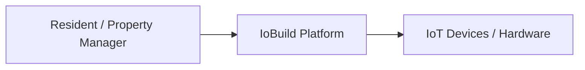
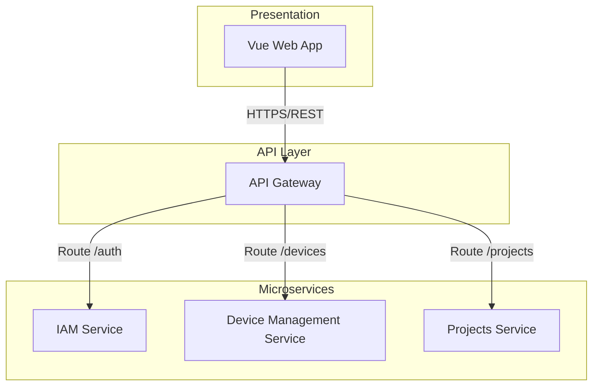
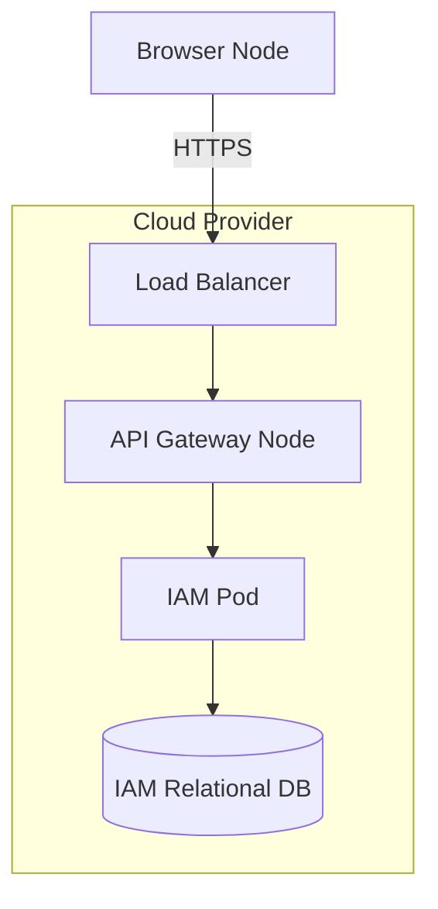
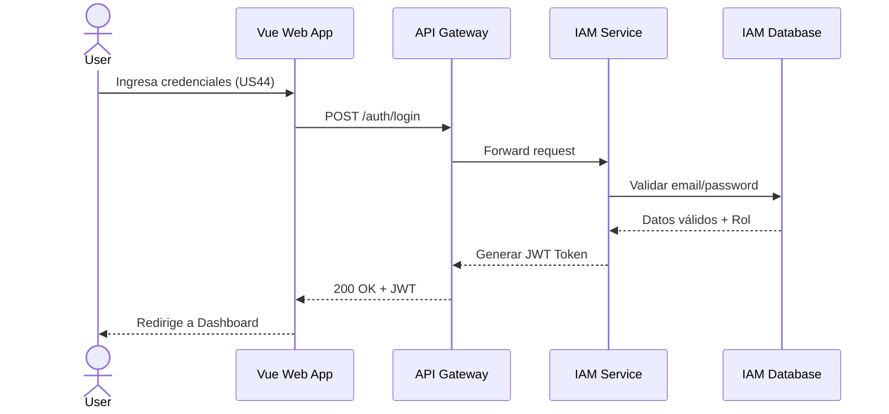

## 4.2.1 Iteration 1: Estableciendo la Arquitectura Base y Seguridad (IAM)

### 4.2.1.1 Architectural Design Backlog 1

* Definir el estilo arquitectónico base para separar el Frontend (aplicación Web en Vue) del Backend.
* Diseñar el mecanismo de enrutamiento para que la aplicación web se comunique con los diferentes servicios (IAM, Projects, Device Management).
* Establecer el mecanismo de seguridad y autenticación para diferenciar los roles de "Property Manager" (Constructora) y "Resident" (Propietario).

### 4.2.1.2 Establish Iteration Goal by Selecting Drivers

**Objetivo de iteración:** Establecer la estructura física y lógica inicial del sistema para soportar clientes web y garantizar la seguridad en el acceso.

| **ID** | **Tipo** | **Descripción** |
| --- | --- | --- |
| CRN-1 | Architectural Concern | Establecer una estructura inicial global del sistema (Greenfield). |
| QA-1 | Quality Attribute | **Seguridad:** Un usuario realiza un intento de inicio de sesión. El sistema valida el rol y otorga acceso en menos de 2 segundos, denegando el 100% de los intentos no autorizados. |
| CON-1 | Constraint | El backend debe implementarse bajo un enfoque de microservicios y despliegue Cloud Native. |
| CON-2 | Constraint | El frontend debe ser desarrollado como una aplicación Web en Vue. |

### 4.2.1.3 Choose One or More Elements of the System to Refine

* **Elementos seleccionados:** Todo el sistema a nivel de contenedores y el Bounded Context de Identity and Access Management (IAM).
* **Alcance / fuera de alcance:** Queda fuera de alcance en esta iteración el diseño detallado de la telemetría de dispositivos (Speed Layer/Batch Layer) y la lógica de pagos.

### 4.2.1.4 Choose One or More Design Concepts That Satisfy the Selected Drivers

| **Concepto** | **Tipo** | **Driver(s) que atiende** | **Trade-off** |
| --- | --- | --- | --- |
| Microservices Architecture | Reference Architecture | CRN-1, CON-1 | Permite despliegue independiente de IAM y Device Management, pero añade complejidad operativa y de red. |
| API Gateway | Patrón Arquitectónico | CRN-1, QA-1 | Centraliza el enrutamiento y validación de tokens, pero puede convertirse en un cuello de botella si no escala adecuadamente. |
| JWT (JSON Web Tokens) Stateless | Táctica de Seguridad | QA-1 | Facilita la escalabilidad sin guardar sesión en memoria, pero dificulta la revocación inmediata de accesos. |

**Domain & Safety Check:**

* **¿Hay datos de dinero/pagos/autorización crítica involucrados?** Sí, autorización crítica (control de accesos a dispositivos físicos).
* **¿Qué modelo de consistencia se elige y por qué?** Consistencia fuerte para la base de datos de IAM (identidad de usuarios), garantizando que un cambio de contraseña o rol se refleje sin retrasos.
* **Restricciones adicionales:** Prohibido usar JWT de larga duración sin un mecanismo de invalidación rápido, para evitar que un token comprometido vulnere espacios físicos.

### 4.2.1.5 Instantiate Architectural Elements, Allocate Responsibilities, and Define Interfaces

#### Elementos y responsabilidades

| **Elemento** | **Responsabilidad** |
| --- | --- |
| IoBuild Vue Web App | Interfaz de usuario (Frontend) para interactuar con la plataforma. Consumo de API REST. |
| IoBuild API Gateway | Recibir tráfico de internet, validar la integridad del JWT y enrutar las peticiones al microservicio adecuado. |
| IAM Microservice | Gestionar identidades, roles, autenticación y emisión de tokens JWT seguros. |
| Device Mgmt Microservice | Proveer la lógica de negocio sobre el estado y control remoto de los dispositivos IoT. |

#### Interfaces iniciales

| **Interfaz** | **Operación** | **Request** | **Response** |
| --- | --- | --- | --- |
| IAM API | POST /auth/login | { email, password } | 200 OK: { token: "jwt", role: "Resident" } |

### 4.2.1.6 Sketch Views (C4 & UML) and Record Design Decisions

**Vista de Contexto (C4 Nivel 1)**

**Vista de Módulos / Componentes (C4 Nivel 2)**

**Vista de Despliegue**

**Secuencia de UC Crítico (US44 - Login)**

#### Registro de decisiones (ADR-lite)

| **ID** | **Decisión** | **Racional** | **Impacto** | **Estado** |
| --- | --- | --- | --- | --- |
| ADR-01 | Adoptar API Gateway. | Centralizar validación de seguridad (QA-1) y simplificar el cliente web. | Añade un componente de infraestructura crítico. | Aprobado |
| ADR-02 | Separar IAM como Microservicio independiente. | Evitar acoplamiento entre reglas de seguridad y lógica de dispositivos IoT (CRN-1). | Requiere diseño de red y comunicación inter-servicio. | Aprobado |

#### Conceptos descartados (Higiene de iteración)

| **Concepto descartado** | **Motivo** | **Reemplazo** | **Evidencia de limpieza** |
| --- | --- | --- | --- |
| Arquitectura Monolítica | Violaba la restricción (CON-1) y limitaba el escalado independiente de dispositivos. | Microservicios | Eliminado de todos los diagramas de módulos. |

### 4.2.1.7 Analysis of Current Design and Review Iteration Goal (Kanban Board)

#### Matriz de cobertura de drivers

| **Driver** | **Estado** | **Evidencia** | **Pendiente** |
| --- | --- | --- | --- |
| CRN-1 | Addressed | Diagramas de componentes y despliegue definidos. | N/A |
| QA-1 | Partially Addressed | Microservicio IAM definido y JWT propuesto en secuencia. | Falta definir estrategia de revocación rápida de JWT (Caché global). |
| CON-1 | Addressed | Arquitectura orientada a microservicios reflejada en vistas. | N/A |
| CON-2 | Addressed | Cliente establecido como "Vue Web App". | N/A |

#### Riesgos residuales

* El API Gateway representa un *Single Point of Failure* si no se configura con redundancia y alta disponibilidad.
* Al gestionar dispositivos físicos, un JWT expirado durante la ejecución de un comando (ej. abrir una puerta inteligente) podría causar un bloqueo operativo no deseado.

#### Próximo objetivo de iteración

Diseñar la comunicación asíncrona, el modelado de datos para el Device Management y la persistencia de la telemetría (IoT).

#### Quality gate (Checklist)

* [X] Todos los drivers foco tienen estado.
* [X] Decisiones críticas con trade-off explícito.
* [X] Vistas suficientes para entender estructura + comportamiento.
* [X] Pendientes y PoCs definidos.
* [X] Si hay pagos/seguridad crítica, consistencia fuerte garantizada.
* [X] Si hay caché L1 de permisos, invalidación global definida (marcado como pendiente/partial).
* [X] Conceptos descartados fueron explicitados y limpiados.

*[Nota para el equipo: Insertar aquí la captura de pantalla del Kanban Board (Trello) demostrando el avance del Sprint asociado a estas decisiones.]*