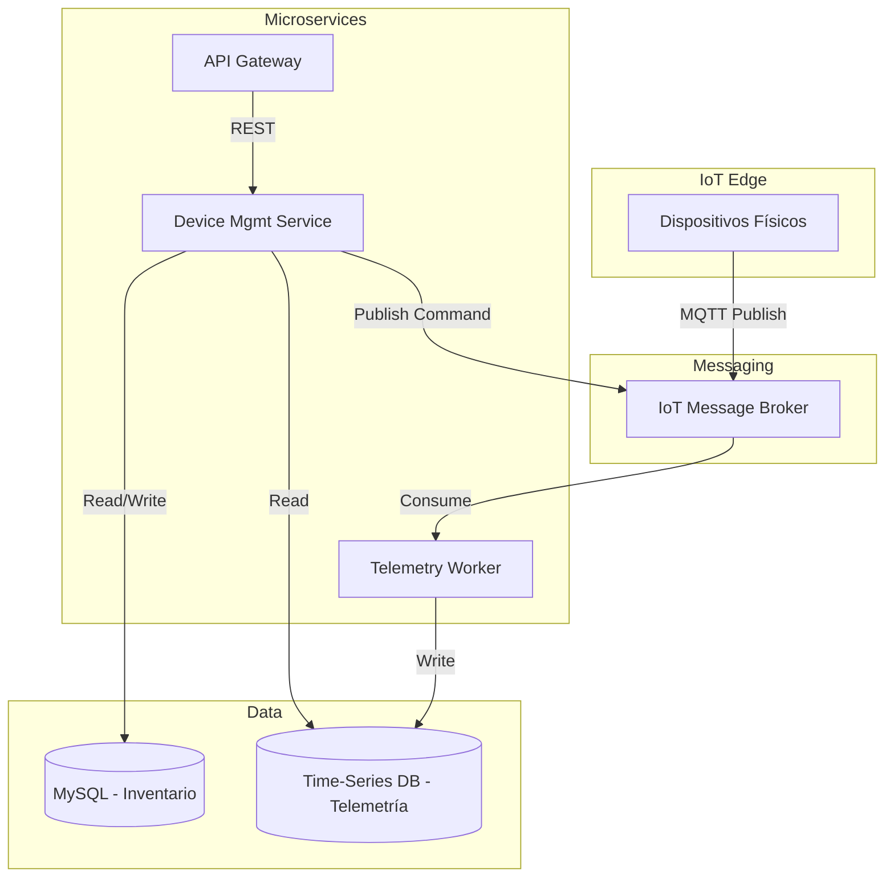
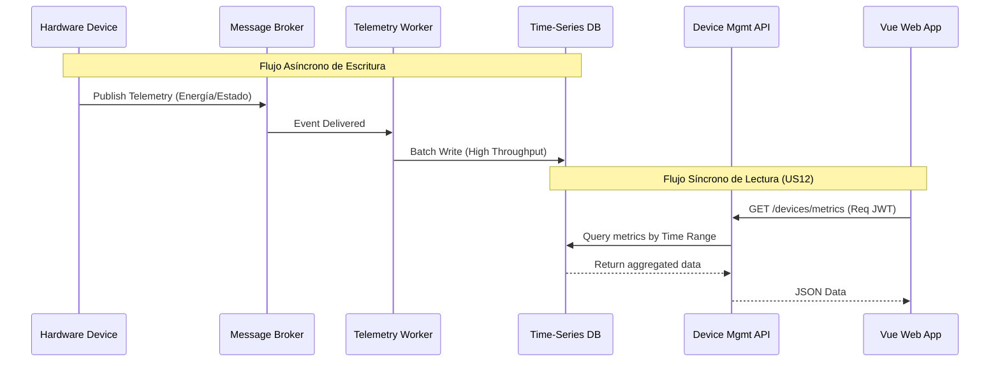

# 4.2.2 Iteration 2: Gestión de Dispositivos IoT y Procesamiento de Telemetría

## 4.2.2.1 Architectural Design Backlog 2

* Definir el patrón de comunicación asíncrona entre los dispositivos físicos (IoT) y el backend.
* Diseñar el mecanismo de persistencia adecuado para datos de alta frecuencia (telemetría y consumo de energía).
* Establecer el flujo para la actualización del estado en tiempo real en el frontend (Vue Web App).

## 4.2.2.2 Establish Iteration Goal by Selecting Drivers

**Objetivo de iteración:** Diseñar la arquitectura de ingesta de eventos y persistencia para soportar el alto volumen de telemetría IoT y permitir la visualización de métricas en tiempo real sin degradar el rendimiento del sistema core.

| ID | Tipo | Descripción |
| --- | --- | --- |
| QA-2 | Quality Attribute | **Escalabilidad / Rendimiento:** Múltiples dispositivos envían telemetría simultáneamente. El sistema procesa los estados sin interrumpir la operación web. |
| US12 | Primary Functionality | Gráfico de consumo de energía por hora para evaluar el rendimiento energético de los proyectos. |
| US33 | Primary Functionality | Ver la lista de dispositivos registrados y monitorear su estado y ubicación en tiempo real. |
| CRN-3 | Architectural Concern | Separación del almacenamiento de telemetría (alta escritura) del inventario relacional estático. |

## 4.2.2.3 Choose One or More Elements of the System to Refine

* **Elementos seleccionados:** Device Management Microservice, capa de comunicación con hardware IoT, y modelo de base de datos de dispositivos.
* **Alcance / fuera de alcance:** Queda fuera de alcance en esta iteración el diseño del Bounded Context de Pagos (Payments) y Suscripciones.

## 4.2.2.4 Choose One or More Design Concepts That Satisfy the Selected Drivers

| Concepto | Tipo | Driver(s) que atiende | Trade-off |
| --- | --- | --- | --- |
| Event-Driven Architecture (Message Broker / MQTT) | Reference Architecture | QA-2, US33 | Desacopla la recepción de eventos de alta frecuencia del procesamiento REST, pero requiere administrar un Broker de mensajes adicional. |
| Time-Series Database (TSDB) o NoSQL para Telemetría | Táctica de Datos | QA-2, US12, CRN-3 | Optimizado para escrituras masivas y queries por rango de tiempo. Aumenta la complejidad políglota de persistencia. |
| CQRS (Command and Query Responsibility Segregation) (Parcial) | Patrón Arquitectónico | QA-2 | Separa la escritura (telemetría) de la lectura (dashboard web), mejorando el throughput. Añade complejidad de sincronización. |

### Domain & Safety Check (previo a diagramas)

* **¿Hay datos de dinero/pagos/autorización crítica involucrados?** Esta iteración maneja telemetría (estado operativo y consumo), no pagos directos. Sin embargo, el estado operativo (ej. abrir/cerrar cerradura) es sensible a nivel de seguridad física.
* **¿Qué modelo de consistencia se elige y por qué?** Consistencia Eventual para los gráficos de telemetría (US12) ya que un retraso de ms/segundos es aceptable. Consistencia Fuerte para comandos de actuación críticos (ej. enviar orden de apertura desde la web al broker).
* **¿Qué patrones quedan explícitamente prohibidos en este contexto?** Queda prohibido usar *HTTP síncrono* desde los dispositivos IoT directamente a la base de datos transaccional, ya que los picos de carga de telemetría derribarían la base de datos principal de la plataforma.

## 4.2.2.5 Instantiate Architectural Elements, Allocate Responsibilities, and Define Interfaces

### Elementos y responsabilidades

| Elemento | Responsabilidad |
| --- | --- |
| IoT Message Broker (ej. MQTT / AWS IoT) | Ingesta escalable de mensajes provenientes de los dispositivos físicos. Encola y distribuye los eventos de hardware. |
| Device Mgmt Service (Command) | Recibe acciones del usuario vía REST y emite comandos seguros hacia los dispositivos a través del Broker. |
| Telemetry Worker / Processor | Consume eventos del Broker de manera asíncrona y los persiste optimizados para consultas temporales. |
| Time-Series DB (ej. MongoDB Time Series) | Almacena el histórico inmutable de mediciones de energía y cambios de estado a lo largo del tiempo. |
| Relational DB (MySQL) | Almacena el inventario estático de dispositivos (ID, Propietario, Ubicación asignada, Parámetros fijos). |

### Interfaces iniciales

| Interfaz | Operación | Payload / Contrato |
| --- | --- | --- |
| MQTT Topic | Publish device/{id}/telemetry | { "energy\_kwh": 0.5, "status": "online", "timestamp": "..." } |
| Device API | GET /devices/{id}/energy?range=1h | 200 OK: Array de mediciones de la última hora listas para graficar (US12). |

## 4.2.2.6 Sketch Views (C4 & UML) and Record Design Decisions

### Vista de módulos/componentes

### Secuencia de UC crítico (US12 / US33 - Ingesta y Lectura)

### Registro de decisiones (ADR-lite)

| ID | Decisión | Racional | Impacto | Estado |
| --- | --- | --- | --- | --- |
| ADR-03 | Uso de Broker MQTT para ingesta IoT. | Desacopla la alta carga de eventos de telemetría de las APIs REST web (QA-2). | Requiere infraestructura adicional (ej. Mosquitto, RabbitMQ, AWS IoT). | Aprobado |
| ADR-04 | Persistencia Políglota (MySQL + TSDB). | Separar datos transaccionales de telemetría temporal evita bloqueos y optimiza consultas analíticas (US12). | Aumenta la complejidad del despliegue y mantenimiento de datos (CRN-3). | Aprobado |

### Conceptos descartados (Higiene de iteración)

| Concepto descartado | Motivo | Reemplazo | Evidencia de limpieza |
| --- | --- | --- | --- |
| Guardar telemetría en MySQL (Tabla única relacional) | Con miles de eventos por minuto, las operaciones I/O bloquearían la base de datos transaccional y degradarían todo el rendimiento de la web. | Time-Series DB + Message Broker | Se refleja la DB separada en el diagrama C4 de componentes. |

## 4.2.2.7 Analysis of Current Design and Review Iteration Goal (Kanban Board)

### Matriz de cobertura de drivers

| Driver | Estado | Evidencia | Pendiente |
| --- | --- | --- | --- |
| QA-2 | Addressed | Introducción del Message Broker y Telemetry Worker para el desacople asíncrono. | Realizar pruebas de carga (Stress Test) sobre el broker simulando 10,000 eventos simultáneos. |
| US12 | Addressed | Integración de Time-Series DB optimizada para queries de rango temporal. | N/A |
| US33 | Addressed | Vista de secuencia documentada mostrando la lectura sincrónica de estado consolidado. | Implementar WebSockets para hacer un "push" automático de estados críticos a la UI sin requerir recargar la página. |
| CRN-3 | Addressed | ADR-04 (Persistencia Políglota) explícitamente documentado y modelado. | N/A |

### Riesgos residuales

* Aumento de la complejidad operativa en la gestión de infraestructura al tener que administrar y respaldar un MySQL y una base de datos de Series de Tiempo simultáneamente.
* Garantizar el *Exactly-Once Processing* o la Idempotencia en el Telemetry Worker para no duplicar datos de consumo de energía en caso de reintentos de red desde los dispositivos.

### Próximo objetivo de iteración

Diseñar los flujos de Suscripciones (Subscriptions) y Planes, incluyendo la integración con pasarelas de pago externas y la validación estricta de permisos según la cuota del plan activo del cliente.

### Quality gate (Checklist)

* [X] Todos los drivers foco tienen estado.
* [X] Decisiones críticas con trade-off explícito.
* [X] Vistas suficientes para entender estructura + comportamiento.
* [X] Pendientes y PoCs definidos.
* [X] Si hay pagos/seguridad crítica, consistencia fuerte garantizada (Garantía de idempotencia en telemetría cubierta como riesgo a mitigar).
* [X] Conceptos descartados fueron explicitados y limpiados.

*[Nota para el equipo: Insertar aquí la captura de pantalla del Kanban Board (Trello) demostrando el avance del Sprint asociado a estas tareas. Con esto se da por concluido el Avance 2.]*