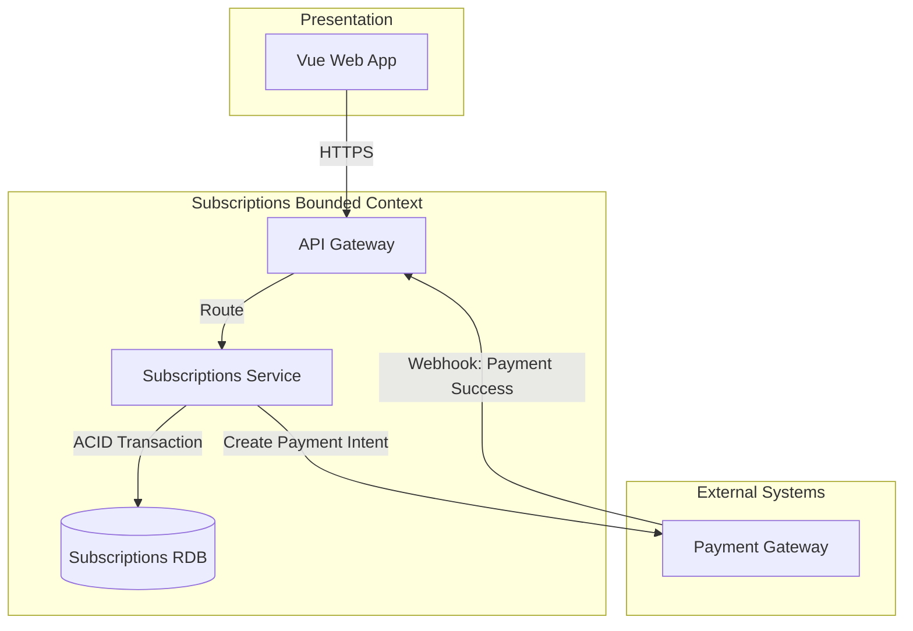
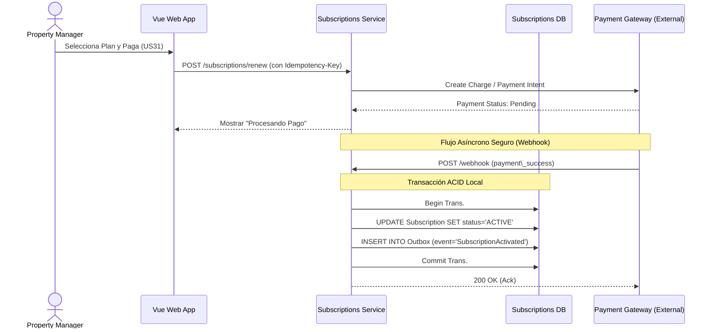

## 4.2.3 Iteration 3: Gestión de Suscripciones, Planes y Pagos Seguros

### 4.2.3.1 Architectural Design Backlog 3

* Diseñar el flujo de integración con pasarelas de pago externas para el cobro de suscripciones (B2B y B2C).
* Garantizar la consistencia transaccional al momento de confirmar un pago y activar los beneficios del plan.
* Diseñar el mecanismo de notificación (webhooks) desde el proveedor de pagos hacia el sistema para automatizar renovaciones o cancelaciones.

### 4.2.3.2 Establish Iteration Goal by Selecting Drivers

**Objetivo de iteración:** Diseñar un mecanismo seguro, idempotente y consistente para procesar pagos y gestionar el ciclo de vida de las suscripciones, asegurando que los usuarios reciban los beneficios de su plan inmediatamente después del cobro exitoso.

| ID | Tipo | Descripción |
| --- | --- | --- |
| **QA-3** | Quality Attribute | **Confiabilidad / Consistencia:** Al confirmar un pago, el sistema procesa el cobro y actualiza el estado de la suscripción de forma atómica. Si ocurre un fallo de red, no se pierde la confirmación del pago ni se duplican cobros. |
| **US28** | Primary Functionality | Ver el plan de suscripción actual y su estado para confirmar los beneficios que se tienen. |
| **US31** | Primary Functionality | Renovar el plan activo para asegurar la continuidad del servicio. |
| **CON-1** | Constraint | El backend debe implementarse bajo un enfoque de microservicios. |

### 4.2.3.3 Choose One or More Elements of the System to Refine

* **Elementos seleccionados:** Microservicio de Suscripciones (Subscriptions & Plans), integración con Pasarela de Pagos (External System) y base de datos relacional de facturación.
* **Alcance / fuera de alcance:** Queda fuera de alcance el diseño de las facturas (invoices) en formato PDF, centrándonos exclusivamente en la transición de estados de la suscripción tras el pago.

### 4.2.3.4 Choose One or More Design Concepts That Satisfy the Selected Drivers

| Concepto | Tipo | Driver(s) que atiende | Trade-off |
| --- | --- | --- | --- |
| **Transactional Outbox Pattern** | Patrón de Microservicios | QA-3 | Garantiza que si la base de datos de suscripciones se actualiza, el evento de "Plan Activado" se emite sin pérdida de datos hacia otros servicios. Incrementa la complejidad de la base de datos. |
| **External Payment Gateway Integration (Webhooks)** | Patrón de Integración | US31, QA-3 | Delega el cumplimiento de normas de seguridad de tarjetas de crédito (PCI-DSS) a un tercero (ej. Stripe), pero nos obliga a manejar la asincronía de los webhooks de confirmación. |
| **Idempotency Keys** | Táctica de Confiabilidad | QA-3 | Evita cobros duplicados si un cliente hace doble clic accidentalmente o si la pasarela de pagos reenvía el webhook por latencia. |

#### Domain & Safety Check (previo a diagramas)

* **¿Hay datos de dinero/pagos/autorización crítica involucrados?** Sí, el cobro de suscripciones (dinero) y la habilitación de permisos según el plan contratado.
* **¿Qué modelo de consistencia se elige y por qué?** Consistencia Fuerte (ACID) en la base de datos de Subscriptions para el registro de la transacción y el estado de la suscripción.
* **¿Cómo se garantiza idempotencia y no pérdida de eventos?** Todas las peticiones al endpoint de Webhooks y de creación de pagos exigen un Idempotency-Key único por intento. El patrón *Transactional Outbox* previene la pérdida del evento de confirmación.
* **¿Qué patrones quedan explícitamente prohibidos en este contexto?** Consistencia Eventual básica o el patrón *Fire-and-Forget* para la validación de pagos quedan prohibidos, ya que un fallo en la red dejaría al usuario con un cargo en su tarjeta pero sin acceso a la plataforma.

### 4.2.3.5 Instantiate Architectural Elements, Allocate Responsibilities, and Define Interfaces

#### Elementos y responsabilidades

| Elemento | Responsabilidad |
| --- | --- |
| **Subscriptions Service** | Administrar el catálogo de planes, generar intenciones de pago y actualizar el estado de las suscripciones (Activa, Expirada, Cancelada). |
| **Payment Gateway (Stripe/MercadoPago)** | Sistema externo responsable de procesar la tarjeta de crédito de manera segura y notificar al backend sobre el resultado del cargo. |
| **Subscriptions Relational DB** | Persistir las suscripciones, el historial de transacciones y la tabla del *Outbox* mediante transacciones ACID. |

#### Interfaces iniciales

| Interfaz | Operación | Request | Response |
| --- | --- | --- | --- |
| Webhook API | POST /api/webhooks/payment | Evento criptográficamente firmado por la pasarela de pago (ej. payment\_intent.succeeded). | 200 OK (Ack para detener reintentos externos). |

### 4.2.3.6 Sketch Views (C4 & UML) and Record Design Decisions

#### Vista de módulos/componentes

#### Secuencia de UC crítico (US31 - Renovar / Pagar Plan)

#### Registro de decisiones (ADR-lite)

| ID | Decisión | Racional | Impacto | Estado |
| --- | --- | --- | --- | --- |
| ADR-05 | Delegar el procesamiento de tarjetas a una pasarela externa y usar Webhooks. | Evitar que la infraestructura propia almacene datos sensibles de tarjetas (Cumplimiento PCI-DSS). | El flujo de activación de la suscripción se vuelve asíncrono y requiere manejo de reintentos. | Aprobado |
| ADR-06 | Implementar claves de idempotencia en peticiones financieras. | Prevenir que los reintentos automáticos del Webhook (debidos a latencia) dupliquen la activación o el cobro en la base de datos (QA-3). | Requiere almacenar un registro temporal de IDs de transacción ya procesadas. | Aprobado |

#### Conceptos descartados (Higiene de iteración)

| Concepto descartado | Motivo | Reemplazo | Evidencia de limpieza |
| --- | --- | --- | --- |
| Actualización asíncrona simple sin Outbox (*Fire and Forget*) | Si el microservicio de Suscripciones notificaba al servicio IAM del cambio de plan directamente en memoria y fallaba, el pago se registraba pero los permisos no se activaban. | Transactional Outbox Pattern | Incorporación explícita de la tabla Outbox en la transacción ACID del diagrama de secuencia. |

### 4.2.3.7 Analysis of Current Design and Review Iteration Goal (Kanban Board)

#### Matriz de cobertura de drivers

| Driver | Estado | Evidencia | Pendiente |
| --- | --- | --- | --- |
| **QA-3** | Addressed | Diagrama de secuencia muestra Transacción ACID local y el patrón Outbox. Se utiliza clave de idempotencia. | N/A |
| **US28** | Addressed | Base de datos relacional modelada para consultar instantáneamente el estado activo del plan. | N/A |
| **US31** | Addressed | Flujo de renovación diseñado vía integración con Pasarela de Pago Externa. | Implementar el Frontend de la pasarela (ej. Stripe Elements). |

#### Riesgos residuales

* Dependencia de la disponibilidad (Uptime) de la pasarela de pagos externa. Si el proveedor externo se cae, no se podrán recibir nuevas suscripciones ni procesar renovaciones.

#### Próximo objetivo de iteración

Concluir la fase de diseño arquitectónico y dar paso a la configuración del entorno de desarrollo (Software Configuration Management), definiendo convenciones de código y el flujo de ramas (GitFlow) para los Sprints de implementación.

#### Quality gate (Checklist)

[X] Todos los drivers foco tienen estado.

[X] Decisiones críticas con trade-off explícito.

[X] Vistas suficientes para entender estructura + comportamiento.

[X] Pendientes y PoCs definidos.

[X] Si hay pagos/seguridad crítica, consistencia fuerte garantizada (Outbox e Idempotencia implementados).

[X] Conceptos descartados fueron explicitados y limpiados.

*[Nota para el equipo: Insertar aquí la captura de pantalla del Kanban Board (Trello) demostrando las tareas asociadas al módulo de Suscripciones y Pagos en estado Done/In Progress.]*