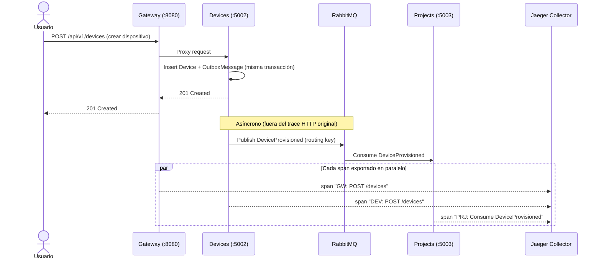

## 4.2.4 Iteration 4: Observabilidad y Trazabilidad Distribuida (OpenTelemetry + Jaeger)

### 4.2.4.1 Architectural Design Backlog 4

* Diseñar un mecanismo para reconstruir el recorrido completo de una request que cruza múltiples microservicios (Gateway → servicio → base de datos / broker).
* Instrumentar los 7 microservicios .NET sin duplicar código de configuración en cada uno.
* Exponer una interfaz de consulta de trazas para que un operador pueda diagnosticar una request lenta o un error intermitente sin correlacionar logs de contenedores a mano.

### 4.2.4.2 Establish Iteration Goal by Selecting Drivers

**Objetivo de iteración:** Instrumentar el sistema con tracing distribuido para que cualquier request cruzando Gateway → microservicio(s) → infraestructura (MySQL, RabbitMQ) sea reconstruible como un único trace end-to-end, sin agregar lógica de negocio nueva ni tocar el modelo de datos de dominio.

| ID | Tipo | Descripción |
| --- | --- | --- |
| **QA-4** | Quality Attribute | **Observabilidad / Diagnosticabilidad:** Ante una request que atraviesa 2 o más microservicios, un operador puede abrir un único trace y ver la duración de cada salto (Gateway → servicio → BD/broker) sin acceder a logs de contenedores individuales. |
| **CRN-2** | Architectural Concern | Instrumentar de forma transversal (Shared Library) para que agregar tracing a un microservicio nuevo no requiera código repetido en cada `Program.cs`. |
| **CON-1** | Constraint | El backend debe implementarse bajo un enfoque de microservicios — la observabilidad debe funcionar igual de bien con N servicios sin acoplarlos entre sí. |

### 4.2.4.3 Choose One or More Elements of the System to Refine

* **Elementos seleccionados:** Los 7 microservicios .NET (IAM, Devices, Projects, Subscriptions, Analytics, Profiles, Gateway) y `IoBuild.Shared` como punto único de configuración.
* **Alcance / fuera de alcance:** Quedan **fuera de alcance** las otras dos "pilares" de observabilidad (métricas tipo Prometheus y logs centralizados tipo Loki/ELK) — esta iteración cubre únicamente **trazas distribuidas (tracing)**. También queda fuera el frontend (Vue/Nginx) y el simulador IoT en Python, que no emiten spans.

### 4.2.4.4 Choose One or More Design Concepts That Satisfy the Selected Drivers

| Concepto | Tipo | Driver(s) que atiende | Trade-off |
| --- | --- | --- | --- |
| **OpenTelemetry SDK con auto-instrumentación** (ASP.NET Core + HttpClient) | Táctica de Observabilidad | QA-4, CRN-2 | Cubre automáticamente cada request HTTP entrante y saliente sin instrumentar manualmente cada endpoint, pero no captura spans de lógica interna (ej. una query EF Core lenta) sin instrumentación adicional. |
| **Exportación OTLP a un colector centralizado (Jaeger)** | Patrón de Integración | QA-4 | Un solo lugar para consultar cualquier trace del sistema, en vez de logs dispersos por contenedor. Agrega un componente más a operar (aunque liviano: `jaegertracing/all-in-one`). |
| **Extensión compartida `AddIoBuildObservability` en `IoBuild.Shared`** | Táctica de Reutilización | CRN-2, CON-1 | Una sola línea (`services.AddIoBuildObservability("NombreServicio")`) por microservicio. Si el endpoint OTLP cambia, se actualiza en un solo lugar (variable de entorno), no en 7 `Program.cs`. |

**Domain & Safety Check:**

* **¿Hay datos de dinero/pagos/autorización crítica involucrados?** No directamente — el tracing no persiste payloads de negocio, solo metadata de la request (ruta, duración, status code, nombre del servicio). Se evaluó no registrar headers de Authorization en los spans para no exponer JWTs en Jaeger.
* **¿Qué modelo de consistencia se elige y por qué?** No aplica — las trazas son datos de observabilidad, no de negocio; su pérdida (ej. reinicio de Jaeger) no afecta la consistencia del sistema.
* **Restricciones adicionales:** Prohibido loguear el body completo de requests de IAM o Subscriptions como atributo de span (riesgo de exponer credenciales o datos de pago en la UI de Jaeger).

### 4.2.4.5 Instantiate Architectural Elements, Allocate Responsibilities, and Define Interfaces

#### Elementos y responsabilidades

| Elemento | Responsabilidad |
| --- | --- |
| **`AddIoBuildObservability` (IoBuild.Shared)** | Configura el SDK de OpenTelemetry, la instrumentación de ASP.NET Core y HttpClient, y el exportador OTLP para cualquier microservicio que la invoque. |
| **Jaeger All-in-One** | Colector OTLP + almacenamiento de trazas (en memoria) + UI de consulta. |
| **Cada microservicio (`Program.cs`)** | Invoca `AddIoBuildObservability(nombreDelServicio)` una vez al arrancar; no requiere código adicional en controladores. |

#### Interfaces iniciales

| Interfaz | Operación | Request | Response |
| --- | --- | --- | --- |
| OTLP gRPC | `POST` interno (SDK → colector) | Spans serializados en protobuf | `200` (aceptado por el colector) |
| Jaeger UI | `GET /search` (UI web) | Filtro por servicio / operación / rango de tiempo | Lista de traces + vista de waterfall por trace |

### 4.2.4.6 Sketch Views (C4 & UML) and Record Design Decisions

#### Vista de un trace cruzando microservicios

#### Registro de decisiones (ADR-lite)

| ID | Decisión | Racional | Impacto | Estado |
| --- | --- | --- | --- | --- |
| ADR-13 | Usar OpenTelemetry con auto-instrumentación en vez de tracing manual por endpoint. | Cubrir el 100% de las rutas HTTP sin mantenimiento por endpoint nuevo (QA-4, CRN-2). | Los spans de lógica interna (ej. una consulta EF Core específica) no aparecen sin instrumentación manual adicional — aceptado como límite conocido. | Aprobado |
| ADR-14 | Usar Jaeger All-in-One sin almacenamiento persistente (memoria/badger efímero) en vez de un backend productivo (Elasticsearch/Cassandra). | Para el volumen de tráfico del proyecto, un backend productivo es sobre-ingeniería; el objetivo es diagnosticar, no auditar históricamente. | Las trazas se pierden al reiniciar el contenedor de Jaeger — no apto para retención a largo plazo. | Aprobado |

#### Conceptos descartados (Higiene de iteración)

| Concepto descartado | Motivo | Reemplazo | Evidencia de limpieza |
| --- | --- | --- | --- |
| Métricas (Prometheus + Grafana) | Fuera del alcance de esta iteración — el driver QA-4 pide *diagnosticabilidad de requests*, no dashboards de series temporales de infraestructura. | Ninguno (queda como trabajo futuro, no bloquea QA-4). | No hay dependencia de `prometheus`/`grafana` en `docker-compose.yml`. |
| Logs centralizados (Loki / ELK) | Mismo motivo — un tercer pilar de observabilidad que no responde al driver de esta iteración. | Ninguno (queda como trabajo futuro). | No hay dependencia de `loki`/`elasticsearch` en `docker-compose.yml`. |
| Tracing manual con `Activity` explícito en cada controlador | Requiere tocar los 7 microservicios endpoint por endpoint; no escala con CRN-2 (instrumentación transversal). | Auto-instrumentación vía SDK en `IoBuild.Shared` | `AddIoBuildObservability` es la única línea nueva por `Program.cs`. |

### 4.2.4.7 Analysis of Current Design and Review Iteration Goal (Kanban Board)

#### Matriz de cobertura de drivers

| Driver | Estado | Evidencia | Pendiente |
| --- | --- | --- | --- |
| **QA-4** | Addressed | Los 7 microservicios `.NET` exportan spans OTLP a Jaeger; UI pública en `watcher.arroz.dev`. Ver [reporte técnico de la Iteración 4](microservices/docs/iterations/iteration-4-observabilidad.md) para el detalle de cobertura por servicio. | Instrumentación manual de spans de negocio (ej. duración de `OutboxWorker` por ciclo) — no implementada. |
| **CRN-2** | Addressed | `AddIoBuildObservability("NombreServicio")` es la única línea agregada en cada `Program.cs`. | N/A |
| **CON-1** | Addressed | La instrumentación no acopla servicios entre sí — cada uno exporta sus propios spans de forma independiente. | N/A |

#### Riesgos residuales

* Jaeger All-in-One no tiene almacenamiento persistente: un reinicio del contenedor borra el historial de trazas. No apto como fuente de auditoría a largo plazo.
* No hay sampling configurado — se exporta el 100% de las requests. Aceptable a la escala actual del proyecto (demo académica), no recomendable así en un sistema con tráfico real de producción.
* No cubre métricas ni logs — si un problema no se manifiesta como una request lenta o un error HTTP, el tracing por sí solo no lo va a mostrar.

#### Próximo objetivo de iteración

Si el sistema creciera más allá del alcance académico: agregar sampling configurable, almacenamiento persistente para Jaeger (o migrar a un backend gestionado), y cerrar los otros dos pilares de observabilidad (métricas + logs) que quedaron explícitamente fuera de esta iteración.

#### Quality gate (Checklist)

[X] Todos los drivers foco tienen estado.

[X] Decisiones críticas con trade-off explícito.

[X] Vistas suficientes para entender estructura + comportamiento.

[X] Pendientes y PoCs definidos.

[X] Conceptos descartados fueron explicitados y limpiados.
