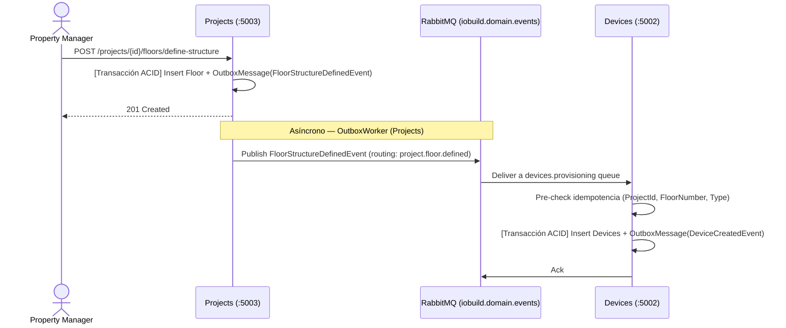

## 4.2.5 Iteration 5: Comunicación Asíncrona entre Bounded Contexts (RabbitMQ Event Bus)

### 4.2.5.1 Architectural Design Backlog 5

* Diseñar el aprovisionamiento automático de dispositivos IoT al definir la estructura de un piso o de una unidad (floor / unit provisioning), sin que Projects necesite conocer el modelo interno de Devices.
* Diseñar la vinculación asíncrona de un propietario a su unidad cuando el usuario se registra en IAM después de que la unidad ya exista (owner-linking por email).
* Garantizar que un evento publicado por un bounded context pueda ser consumido por **múltiples** bounded contexts distintos (Devices, Projects, Analytics) sin que el publicador conozca a sus consumidores.

### 4.2.5.2 Establish Iteration Goal by Selecting Drivers

**Objetivo de iteración:** Extender la comunicación asíncrona entre bounded contexts más allá del caso puntual de pagos (Iteración 3), para soportar aprovisionamiento automático de dispositivos y vinculación de propietarios sin acoplar directamente a Devices, Projects, IAM y Analytics entre sí.

| ID | Tipo | Descripción |
| --- | --- | --- |
| **QA-5** | Quality Attribute | **Consistencia Eventual entre Bounded Contexts:** un evento publicado por un servicio (ej. "piso definido", "usuario registrado") es consumido por N servicios distintos sin pérdida ni duplicación, incluso si un consumidor está caído en el momento de la publicación. |
| **US40** | Primary Functionality | Al definir la estructura de un piso o unidad, el sistema aprovisiona automáticamente los dispositivos IoT del tipo seleccionado por el constructor, sin intervención manual. |
| **US41** | Primary Functionality | Al registrarse un usuario con rol "Owner" cuyo email ya está asociado a una unidad, el sistema vincula automáticamente unidad↔propietario. |
| **CRN-5** | Architectural Concern | Un mismo evento debe poder tener múltiples consumidores en distintos bounded contexts (fan-out), sin que el publicador necesite conocerlos ni acoplarse a ellos. |

### 4.2.5.3 Choose One or More Elements of the System to Refine

* **Elementos seleccionados:** `IoBuild.Shared` (contrato de eventos + publisher), `IoBuild.Devices` (consumidores de aprovisionamiento), `IoBuild.Projects` (consumidor de vinculación de dueños + productor de eventos), `IoBuild.Analytics` (consumidor de read-model).
* **Alcance / fuera de alcance:** Queda fuera de alcance el pipeline de telemetría IoT vía MQTT (ya cubierto en Iteración 2) y el Outbox de pagos de Subscriptions (ya cubierto en Iteración 3, sigue siendo in-process porque QA-3 no requiere fan-out). También queda fuera el registro de dispositivos vía MQTT retenido (`DeviceRegistryAnnouncer`), que es un mecanismo distinto (MQTT, no RabbitMQ) para reconciliar el simulador IoT tras un `docker compose down -v`.

### 4.2.5.4 Choose One or More Design Concepts That Satisfy the Selected Drivers

| Concepto | Tipo | Driver(s) que atiende | Trade-off |
| --- | --- | --- | --- |
| **Topic Exchange** (`iobuild.domain.events`) en vez de Direct/Fanout | Patrón de Mensajería | QA-5, CRN-5 | Permite que cada consumidor haga *bind* solo a los routing keys que le interesan (ej. `project.floor.defined`, `iam.user.#`, `device.#`) sin que el publicador declare consumidores explícitos. Requiere diseñar una convención de routing keys jerárquica desde el día 1. |
| **Reutilización del Transactional Outbox** (Iteración 3) para publicar desde Devices y Projects | Patrón de Microservicios | QA-5 | Mismo patrón ya validado (misma transacción de BD que el cambio de negocio, `OutboxWorker` con reintentos) — no hay que diseñar un mecanismo nuevo de confiabilidad. Cada servicio productor necesita su propia tabla `OutboxMessage` y su propio worker. |
| **Idempotencia por pre-check + índice único (backstop)** en cada consumidor | Táctica de Confiabilidad | QA-5 | Un evento puede reentregarse (at-least-once delivery de RabbitMQ); cada consumidor verifica existencia antes de insertar, y un índice único en BD actúa como red de seguridad si dos entregas llegan concurrentemente. Duplica la validación (aplicación + BD) pero es la única forma de garantizar "exactly-once" efectivo sobre un broker at-least-once. |

**Domain & Safety Check:**

* **¿Hay datos de dinero/pagos/autorización crítica involucrados?** No directamente en el aprovisionamiento de dispositivos; sí indirectamente en owner-linking (vincular la persona correcta a la unidad correcta tiene implicaciones de control de acceso físico).
* **¿Qué modelo de consistencia se elige y por qué?** Consistencia eventual entre bounded contexts (aceptable: unos segundos de delay entre "piso definido" y "dispositivos aprovisionados" no rompe ningún flujo de usuario), con consistencia fuerte (ACID) dentro de cada servicio individual vía el patrón Outbox.
* **Restricciones adicionales:** Prohibido que un consumidor falle silenciosamente ante un mensaje inválido ("poison message") — debe loguearlo y hacer `Nack` sin requeue infinito, para no bloquear la cola.

### 4.2.5.5 Instantiate Architectural Elements, Allocate Responsibilities, and Define Interfaces

#### Elementos y responsabilidades

| Elemento | Responsabilidad |
| --- | --- |
| **`FloorProvisioningConsumer` (Devices)** | Consume `FloorStructureDefinedEvent`, aprovisiona el set de dispositivos por defecto de cada piso. |
| **`UnitDeviceProvisioningConsumer` (Devices)** | Consume `UnitDevicesDefinedEvent`, aprovisiona dispositivos seleccionados por unidad. |
| **`OwnerLinkingConsumer` (Projects)** | Consume `UserRegisteredEvent` (rol Owner), vincula unidades pendientes por email. |
| **`UnitOwnerProjectionConsumer` (Devices)** | Consume `UnitOwnerMatchedEvent`, actualiza la proyección local de dueño por unidad para validar comandos de dispositivos. |
| **`AnalyticsEventConsumer` (Analytics)** | Consume `device.#` y `project.#` (wildcard), mantiene un read-model para dashboards. |
| **`UnitOwnerAnnouncer` (Projects)** | Re-publica `UnitOwnerMatchedEvent` al arrancar, para reconciliar Devices tras un volume wipe. |

#### Interfaces iniciales

| Interfaz | Operación | Routing Key | Consumidor(es) |
| --- | --- | --- | --- |
| Exchange `iobuild.domain.events` | `project.floor.defined` | Piso definido | Devices (`FloorProvisioningConsumer`) |
| Exchange `iobuild.domain.events` | `project.unit.devices.defined` | Dispositivos de unidad seleccionados | Devices (`UnitDeviceProvisioningConsumer`) |
| Exchange `iobuild.domain.events` | `iam.user.#` | Usuario registrado | Projects (`OwnerLinkingConsumer`) |
| Exchange `iobuild.domain.events` | `project.unit.owner-matched` | Dueño vinculado a unidad | Devices (`UnitOwnerProjectionConsumer`), Analytics |
| Exchange `iobuild.domain.events` | `device.#`, `project.#` | Todo evento de Devices/Projects | Analytics (`AnalyticsEventConsumer`, read-model) |

### 4.2.5.6 Sketch Views (C4 & UML) and Record Design Decisions

#### Secuencia de UC crítico (US40 — Aprovisionamiento de dispositivos por piso)

#### Registro de decisiones (ADR-lite)

| ID | Decisión | Racional | Impacto | Estado |
| --- | --- | --- | --- | --- |
| ADR-15 | Topic Exchange único (`iobuild.domain.events`) compartido por todos los productores/consumidores, en vez de un exchange por bounded context. | Un solo exchange con routing keys jerárquicas (`project.floor.defined`, `device.#`) es más simple de operar que N exchanges, y permite que Analytics haga wildcard-bind (`device.#`, `project.#`) sin coordinarse con cada productor nuevo. | Todos los productores comparten un nombre de exchange hardcodeado; si un servicio nuevo necesita aislamiento total, requeriría un exchange separado explícito. | Aprobado |
| ADR-16 | Idempotencia con pre-check en aplicación + índice único en BD como backstop, en cada consumidor. | RabbitMQ garantiza at-least-once, no exactly-once — un mensaje puede reentregarse tras un fallo de red o un restart del consumidor. Sin este doble check, un reintento duplicaría dispositivos o vínculos de dueño. | Cada consumidor nuevo debe implementar el mismo patrón (repetición de código validada como aceptable — es una migración de <20 líneas por consumidor). | Aprobado |

#### Conceptos descartados (Higiene de iteración)

| Concepto descartado | Motivo | Reemplazo | Evidencia de limpieza |
| --- | --- | --- | --- |
| Un exchange por bounded context (Devices, Projects, Analytics con exchanges separados) | Analytics necesita escuchar eventos de Devices Y Projects; múltiples exchanges hubieran requerido *shovel*/federación entre ellos para el wildcard-bind. | Topic Exchange único compartido | `AnalyticsEventConsumer` hace bind directo a `device.#` y `project.#` sobre el mismo exchange. |
| Llamadas HTTP síncronas entre Devices y Projects para aprovisionar dispositivos | Un fallo de red en el momento de "definir estructura" hubiera bloqueado la respuesta al usuario o dejado el piso a medio crear. | Evento asíncrono + Outbox | El endpoint `define-structure` responde `201` sin esperar a que Devices procese nada. |

### 4.2.5.7 Analysis of Current Design and Review Iteration Goal (Kanban Board)

#### Matriz de cobertura de drivers

| Driver | Estado | Evidencia | Pendiente |
| --- | --- | --- | --- |
| **QA-5** | Addressed | Outbox + idempotencia por pre-check/índice único en los 4 consumidores de dominio. Ver [reporte técnico de la Iteración 5](microservices/docs/iterations/iteration-5-eventos-dominio.md). | N/A |
| **US40** | Addressed | `FloorProvisioningConsumer` (14 tests) + `UnitDeviceProvisioningConsumer` (8 tests). | N/A |
| **US41** | Addressed | `OwnerLinkingConsumer` (5 tests) + `UnitOwnerAnnouncer` (4 tests, reconciliación post-restart). | N/A |
| **CRN-5** | Addressed | `AnalyticsEventConsumer` consume el mismo exchange que Devices/Projects sin que estos lo conozcan (fan-out real). | N/A |

#### Riesgos residuales

* No hay propagación de trace context (OpenTelemetry) a través de RabbitMQ — un trace HTTP no incluye el procesamiento asíncrono del consumidor (ver Iteración 4, §7).
* Un mensaje "poison" mal formado se descarta con `Nack(requeue: false)` — no hay Dead Letter Exchange configurado para inspeccionarlos después.

#### Próximo objetivo de iteración

Configurar un Dead Letter Exchange para mensajes poison, y evaluar propagación de trace context (W3C `traceparent`) a través de los headers AMQP para cerrar el gap con la Iteración 4.

#### Quality gate (Checklist)

[X] Todos los drivers foco tienen estado.

[X] Decisiones críticas con trade-off explícito.

[X] Vistas suficientes para entender estructura + comportamiento.

[X] Pendientes y PoCs definidos.

[X] Conceptos descartados fueron explicitados y limpiados.
