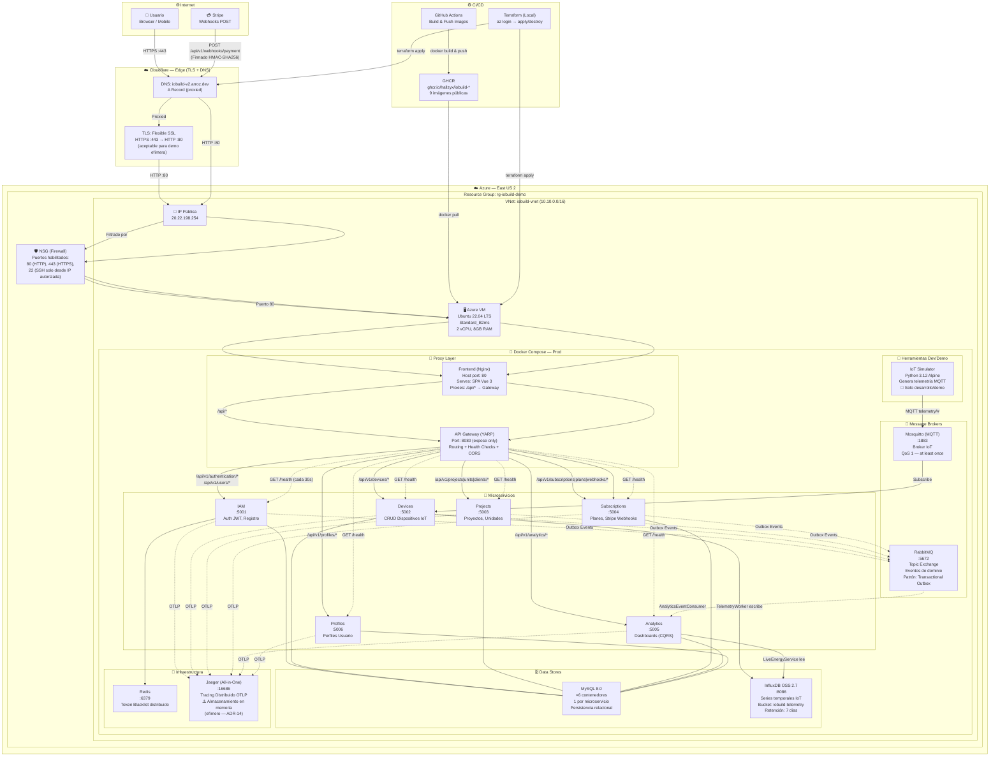

# Cloud Architecture Deployment Diagram — IoBuild

> Diagrama de despliegue en la nube. Validado por revisión cruzada.

```mermaid
graph TB
    subgraph "🌐 Internet"
        User["👤 Usuario\nBrowser / Mobile"]
        Stripe["💳 Stripe\nWebhooks POST"]
    end

    subgraph "☁️ Cloudflare — Edge (TLS + DNS)"
        CF_DNS["DNS: iobuild-v2.arroz.dev\nA Record (proxied)"]
        CF_TLS["TLS: Flexible SSL\nHTTPS :443 → HTTP :80\n(aceptable para demo efímera)"]
    end

    subgraph "☁️ Azure — East US 2"
        subgraph "Resource Group: rg-iobuild-demo"
            NSG["🛡️ NSG (Firewall)\nPuertos habilitados:\n80 (HTTP), 443 (HTTPS),\n22 (SSH solo desde IP autorizada)"]

            subgraph "VNet: iobuild-vnet (10.10.0.0/16)"
                PIP["📡 IP Pública\n20.22.198.254"]
                VM["🖥️ Azure VM\nUbuntu 22.04 LTS\nStandard_B2ms\n2 vCPU, 8GB RAM"]

                subgraph "🐳 Docker Compose — Prod"
                    subgraph "🌊 Proxy Layer"
                        Nginx["Frontend (Nginx)\nHost port: 80\nServes: SPA Vue 3\nProxies: /api/* → Gateway"]
                        YARP["API Gateway (YARP)\nPort: 8080 (expose only)\nRouting + Health Checks + CORS"]
                    end

                    subgraph "🧩 Microservicios"  
                        IAM["IAM\n:5001\nAuth JWT, Registro"]
                        Devices["Devices\n:5002\nCRUD Dispositivos IoT"]
                        Projects["Projects\n:5003\nProyectos, Unidades"]
                        Subs["Subscriptions\n:5004\nPlanes, Stripe Webhooks"]
                        Analytics["Analytics\n:5005\nDashboards (CQRS)"]
                        Profiles["Profiles\n:5006\nPerfiles Usuario"]
                    end

                    subgraph "🗄️ Data Stores"
                        MySQL["MySQL 8.0\n×6 contenedores\n1 por microservicio\nPersistencia relacional"]
                        Influx["InfluxDB OSS 2.7\n:8086\nSeries temporales IoT\nBucket: iobuild-telemetry\nRetención: 7 días"]
                    end

                    subgraph "📨 Message Brokers"
                        MQTT["Mosquitto (MQTT)\n:1883\nBroker IoT\nQoS 1 — at least once"]
                        RMQ["RabbitMQ\n:5672\nTopic Exchange\nEventos de dominio\nPatrón: Transactional Outbox"]
                    end

                    subgraph "🔧 Infraestructura"
                        Redis["Redis\n:6379\nToken Blacklist distribuido"]
                        Jaeger["Jaeger (All-in-One)\n:16686\nTracing Distribuido OTLP\n⚠️ Almacenamiento en memoria\n(efímero — ADR-14)"]
                    end

                    subgraph "🧪 Herramientas Dev/Demo"
                        Sim["IoT Simulator\nPython 3.12 Alpine\nGenera telemetría MQTT\n🧪 Solo desarrollo/demo"]
                    end
                end
            end
        end
    end

    subgraph "⚙️ CI/CD"
        GHA["GitHub Actions\nBuild & Push Images"]
        GHCR["GHCR\nghcr.io/hallzyx/iobuild-*\n9 imágenes públicas"]
        TF["Terraform (Local)\naz login → apply/destroy"]
    end

    %% --- Flujo principal web ---
    User -->|"HTTPS :443"| CF_DNS
    CF_DNS -->|"Proxied"| CF_TLS
    CF_TLS -->|"HTTP :80"| PIP
    PIP -->|"Filtrado por"| NSG
    NSG -->|"Puerto 80"| VM
    VM --> Nginx
    
    Nginx -->|"/api/*"| YARP
    
    YARP -->|"/api/v1/authentication/*\n/api/v1/users/*"| IAM
    YARP -->|"/api/v1/devices/*"| Devices
    YARP -->|"/api/v1/projects|units|clients/*"| Projects
    YARP -->|"/api/v1/subscriptions|plans|webhooks/*"| Subs
    YARP -->|"/api/v1/analytics/*"| Analytics
    YARP -->|"/api/v1/profiles/*"| Profiles

    %% --- Stripe webhooks (no pasan por usuario) ---
    Stripe -->|"POST /api/v1/webhooks/payment\n(Firmado HMAC-SHA256)"| CF_DNS
    CF_DNS -->|"HTTP :80"| PIP
    PIP --> NSG
    NSG --> VM
    VM --> Nginx --> YARP --> Subs

    %% --- Health checks YARP ---
    YARP -.->|"GET /health (cada 30s)"| IAM
    YARP -.->|"GET /health"| Devices
    YARP -.->|"GET /health"| Projects
    YARP -.->|"GET /health"| Subs
    YARP -.->|"GET /health"| Analytics
    YARP -.->|"GET /health"| Profiles

    %% --- Bases de datos (1 por servicio) ---
    IAM --- MySQL
    Devices --- MySQL
    Projects --- MySQL
    Subs --- MySQL
    Analytics --- MySQL
    Profiles --- MySQL

    %% --- Pipeline IoT ---
    Sim -->|"MQTT telemetry/#"| MQTT
    MQTT -->|"Subscribe"| Devices
    Devices -->|"TelemetryWorker escribe"| Influx
    Analytics -->|"LiveEnergyService lee"| Influx

    %% --- Eventos asíncronos (Transactional Outbox) ---
    IAM -.->|"Outbox Events"| RMQ
    Devices -.->|"Outbox Events"| RMQ
    Projects -.->|"Outbox Events"| RMQ
    Subs -.->|"Outbox Events"| RMQ
    RMQ -.->|"AnalyticsEventConsumer"| Analytics

    %% --- Redis (solo IAM) ---
    IAM --> Redis

    %% --- Tracing distribuido (OpenTelemetry) ---
    IAM -.->|"OTLP"| Jaeger
    Devices -.->|"OTLP"| Jaeger
    Projects -.->|"OTLP"| Jaeger
    Subs -.->|"OTLP"| Jaeger
    Analytics -.->|"OTLP"| Jaeger
    Profiles -.->|"OTLP"| Jaeger

    %% --- CI/CD ---
    GHA -->|"docker build & push"| GHCR
    GHCR -->|"docker pull"| VM
    TF -->|"terraform apply"| VM
    TF -->|"terraform apply"| CF_DNS
```
